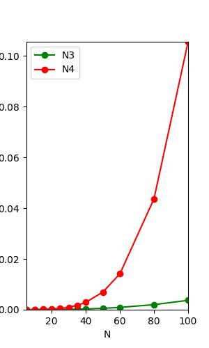

# Requirements

In order to run all the module in the project, you are supposed to have those environment.

- C & C++11 environment.
- python environment (as for packages, check `requirements.txt`)

# Analysis

## N^6^

- For N^6^ version, I just use 6 for loop to iterate the left-top key point (N^2^), the right-bottom key point (N^2^), and calculate the sum of the sub matrix chosen by the two key points  (N^2^).
- Only one matrix with N^2^ size is used to store the input data.
- So the time complexity should be O(N^6^) and the space complexity should be O(N^2^).

## N^4^

- N^4^ version has something inproved based on the N^6^ one. I generate a brand new matrix to calculate the prefix sum of the original matrix. That means, suppose the old matrix is M, and the new one is M', than $M'_{I,J}=\sum^{I,J}_{i,j}M_{i,j}$, so that, we can calculate the sum of any sub matrix indexed by $(i_{lt},j_{lt}),(i_{rb},j_{rb})$ in O(1) by $M^{sub}_{i_{lt},j_{lt},i_{rb},j_{rb}} = M'_{i_{rb},j_{rb}}+M'_{i_{lt}-1,j_{lt}-1}-M'_{i_{rb},j_{lt}-1}-M'_{i_{lt}-1,j_{rb}}$ according to the Inclusion and Exclusion Principle.
- So I use N^2^ memory to deal with the prefix sum matrix, and N^4^ memory to iterate the left-top key point (N^2^ memory) and the right-bottom key point (N^2^ memory).
- One matrix is used to store the input data, another is to store the prefix sum.
- So the time complexity should be O(N^4^) and the space complexity should be O(N^2^).

## N^3^

- This method has very difference between the previous two. It's more like the O(N) approach of the largest sub segment sum. Our idea is to change the matrix into a vector, which means we can directly use the method of the largest sub-terminal sum, which contributes to the complexity of O(N). So the idea is to iterate the upper bound (l2) and the lower bound (l1) on one axis of the matrix, and just flatten this matrix. That means, we will have a new $1\times m$ matrix (actually a vector) $M^{fold}_{l1,l2,1,j} = \sum_{l1\leq i < l2} M_{i,j}$. Then, we just need to do the max sub segment sum on $M^{fold}$.
- You can calculate $M^{fold}$ in O(N^3^) or $O(N^2)$, and I use O(N^2^) here using the prefix sum's idea (just like what I do in N^4^ method, but only one dimension here, you can see details in code comments).
- I use N^2^ memory to store original matrix, the prefix sum matrix, and N memory for fold matrix.
- So the time complexity should be O(N^3^) and the space complexity should be O(N^2^).

## Efficiency Comparison

- Data following is getten on Mac(M1).
- In order to make the data more reasonable and observable, I will generate 10 **different** input data. All the methods will run with the same 10 different input.

|O()|opt|5|10|30|50|80|100|
|-|-|-|-|-|-|-|-|
|O(N^6^)|Iterations(K)| 10 | 10 | 10 | 10 | 10 | 10 |
||Ticks|totTime*1000|totTime*1000|totTime*1000|totTime*1000|totTime*1000|totTime*1000|
||Total Time(sec)|      |      |      |      |      |      |
||Duration(sec)|      |      |      |      |      |      |
|O(N^4^)|Iterations(K)| 10 | 10 | 10 | 10 | 10 | 10 |
||Ticks|totTime*1000|totTime*1000|totTime*1000|totTime*1000|totTime*1000|totTime*1000|
||Total Time(sec)|      |      |      |      |      |      |
||Duration(sec)|      |      |      |      |      |      |
|O(N^3^)|Iterations(K)| 10 | 10 | 10 | 10 | 10 | 10 |
||Ticks|totTime*1000|totTime*1000|totTime*1000|totTime*1000|totTime*1000|totTime*1000|
||Total Time(sec)|      |      |      |      |      |      |
||Duration(sec)|      |      |      |      |      |      |

- $O(N^3)$  vs $O(N^4)$ 

- $O(N^3)$  vs $O(N^4)$  vs $O(N^6)$

