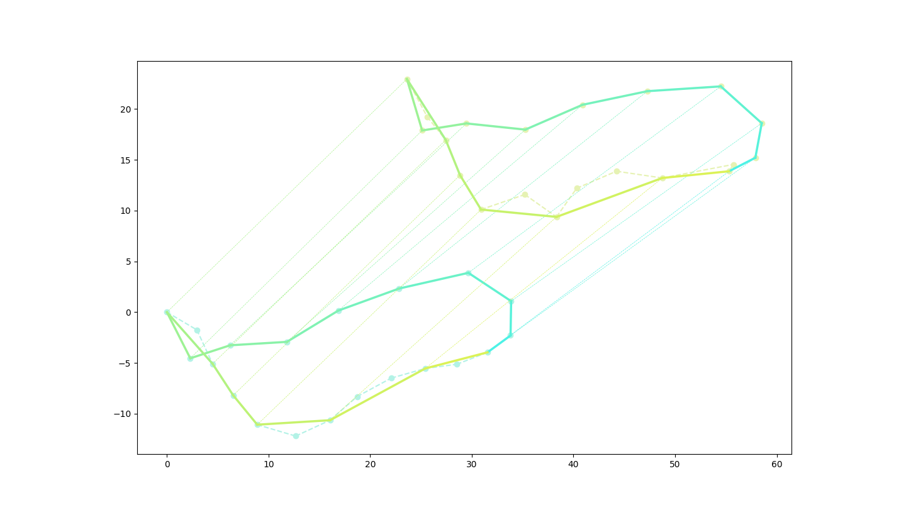

 Voting Tree

 Date: 2022-10.27

 Author: **

> FYA:    **If you want to run my codes, please check `Readme.md` first!**

# Chapter 1: Introduction

## 课题摘要 | Project Abstract

> 在这道题中，输入中将给出两组 **<u>有序点集¹</u>**，每个集合中的元素将被依次给出——在每个集合中第 $i$ 个被给出的点将被命名为 $i$ 。我们需要在点集中找到满足 **<u>单调约束条件³</u>** 的 **<u>公共子图形²</u>**。

---

> In this problem, the input will contain two groups of **<u>Ordered Point Set¹</u>**. Each element of each set will be given one by one, and the $i^\text{th}$ point will be named $i$ . What we should do is to find out the **<u>Common Subgraph²</u>** that fits **<u>Monotone Constraint³</u>**

## 概念定义 | Concept Defination

### 有序点集 | Ordered Point Set

> 本文中**<u>有序点集</u>**是指：具有<u>循环</u>的<u>先后关系</u>的<u>二维点</u>所构成的点集。即集合可以表示为一个环形数列。
>
> 再定义**<u>子有序点集</u>**为<u>保留原有关系</u>的**<u>有序点集</u>**的子集。

- 样例：下面的数列*（隐去了点的坐标）*定义了一个有九个元素的**<u>有序点集</u>**。
  - 比如， `1` 是 `2` 的前驱，是 `9` 的后继。换句话来说，`2` 是 `1` 的后继，`9` 是 `1`；

| `1`   `2`   `3`   `4`   `5`   `6`   `7`   `8`   `9` |
| --------------------------------------------------- |

- 而下面的数列是上面的那个**<u>有序点集</u>**的<u>合法子集</u>。
  - 可以证明，对于任意三个元素，他们的偏序关系都是不变的。

| `6` `9` `1` `2` `5` |
| --------------------------------------------------- |

---

> **<u>Ordered Point Set</u>** here refers to point set composed of <u>2D points</u> with <u>cyclic precedence relation</u>. That is, the set can be seen as a circular sequence as well.
>
> Than, **<u>Sub Ordered Point Set</u>** is the sub set of an **<u>Ordered Point Set</u>**. And the partial order relation shouldn't change.

- Eg. the following array*(The coordinates of the point are hidden)* defines an Ordered Point Set with 9 elements. 
  - For example, `1` is the predecessor of `2` and the successor of `9`. In other words, `9` is the predecessor of `1` and `2` is the successor of `1`.

| `1`   `2`   `3`   `4`   `5`   `6`   `7`   `8`   `9` |
| --------------------------------------------------- |

- The array bellow is the <u>legal sub set</u> of the above <u>Ordered Point Set</u>.
  - It can be proved that, for any three elements, their partial order relation remains unchanged.

| `6` `9` `1` `2` `5` |
| ------------------- |

### 公共子图形 | Common Subgraph

> 本文中**<u>图形</u>**的定义指一个由**<u>有序点集¹</u>**中的元素依次连接形成的曲线，并且满足 $(1)$ 式，不要求闭合，但要求任意点仅连接两条边、任意边仅连接两个点。
>
> 而**<u>子图形</u>**则指的是由**<u>子有序点集¹</u>**定义的**<u>图形</u>**。
>
> 而**<u>公共子图形</u>**，则指的是能够**<u>匹配⁴</u>**的两个**<u>有序点集¹</u>**定义的**<u>子图形</u>**（这意味着**<u>公共子图形</u>**实际上是一对**<u>子图形</u>**）。
>
> - 例如：在 *figure 1.1*中，配对的连线部分为两个**<u>有序点集¹</u>**的**<u>公共子图形</u>**。

---

> **<u>Graph</u>** here refers to a curve formed by the sequential connection of elements in an **<u>Ordered Point Set¹</u>**. And the graph should meets formula $(1)$. It needn't to be closed, but any two points have and only have one common edge, while any two edges have and only have one common point.
>
> And the **<u>Subgraph</u>** refers to a **<u>Graph</u>** defined by a **<u>Sub Ordered Point Set¹</u>**.
>
> Then, the **<u>Common Subgraph</u>** refers to the **<u>Matched⁴</u>** **<u>Subgraphs</u>**(that is, **<u>Common Subgraph</u>** is a pair of **<u>Subgraphs</u>**) of two **<u>Ordered Point Sets¹</u>**.

> - For example, in *figure 1.1*, the pair of solid curves is the **<u>Common Subgraph</u>** of two **<u>Ordered Point Sets¹</u>**. 

---
$$
Points.size = Edge.size
$$

    
     
    
figure 1.1

### 单调约束条件 | Monotone Constraint

> **<u>单调约束条件</u>**指**<u>公共子图形²</u>**结果需要在下标数对在根据 A 图索引进行单调递增（单调递减）排序后，满足 B 图索引也单调递增（单调递减）。而这里的单调定义在**<u>有序点集¹</u>**的偏序关系下。

---

> **<u>Monotone Constraint</u>** means that, after sorting the match pairs from the **<u>Common Subgraph²</u>** by the index of **<u>Graph²</u>** A's as as monotonically increasing(decreasing), the index of **<u>Graph²</u>** B's should also be monotonically increasing(decreasing). The "monotone" here is under the defination of **<u>Ordered Point Set's¹</u>** partial order relation.

### 匹配 | Match

> 首先我们需要定义几个参数，这些参数的具体取值在运行前是可以修改的，在运行时是固定的。（如果您认为不理想，可以尝试**在接口外部**修改这些常数。）
> |参数名| 描述 | 本文采用值 A |本文采用值 B |
> |-|-|-|-|
> |角容差|能够接受的角度绝对误差。| 0.1 |0.1 |
> | 边长比容差 |能够接受的变长比值的绝对误差。| 0.1|0.1 |

> 接下来，我们定义，如果**<u>图形²</u>** A 和**<u>图形²</u>** B 满足式 $(2)$，则称**<u>图形²</u>** A 和**<u>图形²</u>** B **<u>匹配</u>**。

---

> First we should give several params, which can be modified before running but is constant in runtime. (If you thought the matching result is not ideal, try to modify these params **outside of the API**.)
> |Param's Name| Description| Adopted  A | Adopted B |
> |-|-|-|-|
> |Angle Tolerance|The acceptable absolute error of angle.|0.1|0.1|
> |Edge Ratio Tolerance|The acceptable absolute error of ratio of two ordered edges.|0.1|0.1|

> Then we define, if **<u>Graph</u>** A and **<u>Graph</u>** B meet the formula $(2)$, we say **<u>Graph</u>** A and **<u>Graph</u>** B is **<u>matched</u>**.

---

$$
\begin{aligned}
1.\;\; & \text{Operation on index here is defined in an circular queue, that is}\\
& 0-1 = n,\;\; n+1 = 0 ,\;\; \text{where } n \text{ is the number of the points in a graph. }\\\\

2.\;\; & \text{Note graph } A \text{ and graph } B \text{ as } A\{A_1 \rightarrow A_2 \rightarrow ... \rightarrow A_n \rightarrow A_1\} \\
& \text{and } B\{B_1 \rightarrow B_2 \rightarrow ... \rightarrow B_ n \rightarrow B_1\} \text{ , } \text{ and } A_i = \left[
																																\begin{array}{c}
																																	x_i \\
																																	y_i
																																\end{array}
																															\right] \text{ , } \\
& B_i = \left[
	\begin{array}{c}
		u_i \\
		v_i
	\end{array}
\right] \text{ . }\\
& \text{Both } A_i \text{ and } B_i \text{ is called a \textit{point}. }\\\\

\text{If: }\;\; &\exist \; offset = constant,\;\; s.t. \;\; \forall \; 1\leq i,j \leq n ,\;\; \\
	& \left\{\begin{array}{l}
		&dis(i,j) = offset\text{, }\\
		&\big|\angle A_{i} - \angle B_{j} \big| < \text{ Angle Tolerance, }\\
		&\big|\frac{|{A_{i-1}A_{i}}|}{|A_{i}A_{i+1}|} - \frac{|{B_{i-1}B_{i}}|}{|B_{i}B_{i+1}|} \big| < \text{ Edge Ratio Tolerance. }
	\end{array}\right.\\\\
\text{Where: }& dis(i,j) = i-j,\\
& \angle P_i = \arccos\left( \frac{|A_{i-1}A_{i}|^2+|A_{i}A_{i+1}|^2-|A_{i-1}A_{i+1}|^2}{2\cdot|A_{i-1}A_{i}|\cdot|A_{i}A_{i+1}|} \right).\\\\
\text{Then: } & \text{we say they are matched.}
\end{aligned}
$$

# Chapter 2: Algorithm Specification

