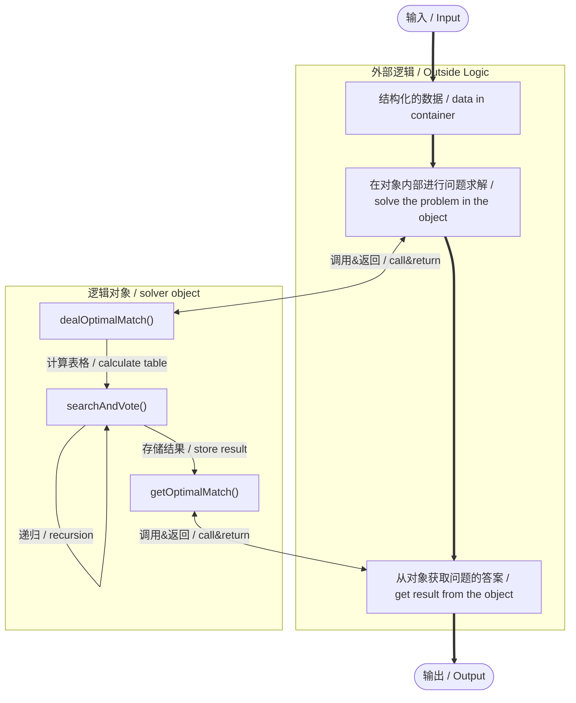
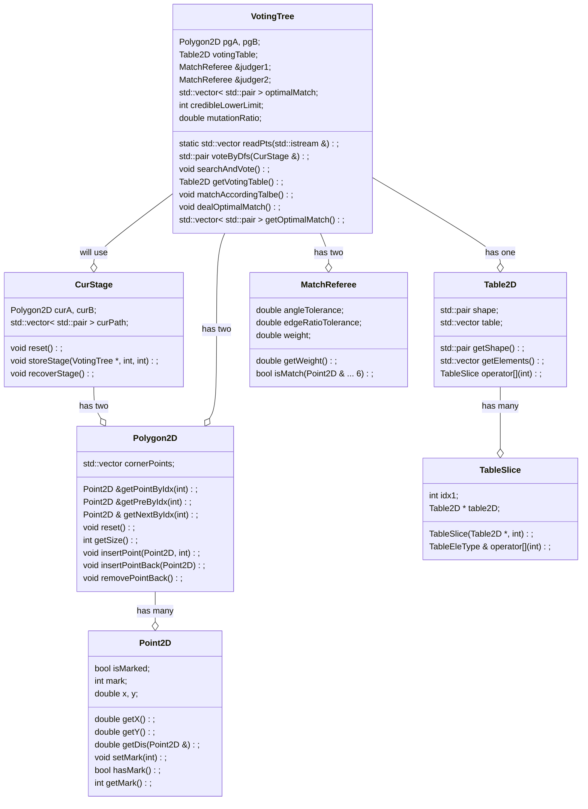

<center><font size = 6> Voting Tree</font></center>
<center><font size = 5> Date: 2022-10.27</font></center>
<center><font size = 5> Author: **</font></center>


> FYA:    **If you want to run my codes, please check `Readme.md` first!**


# Chapter 0: Before Reading

- 当您打开这个项目时，可能会觉得有些吓人并且让您觉得困难，对此我表示抱歉，我也竭尽全力在降低报告的阅读难度。为了让这个看起来非常浪费时间的大作业更有意义一些，我选择使用它来练习一些工程技巧。在本项目中，我强迫自己使用相对规范的面向对象语义来完成这份作业，尽管它看起来并不那么优雅。
- 但是请不要为阅读一份 OOP 代码感到畏惧，它实际上非常易读，不过我将给您一些阅读建议：
  - 不用尝试去理解代码中的语法细节，而是专注于核心逻辑。OOP 可以看作一种封装风格，我也尽可能地将每一层逻辑化得尽可能简单。（如果您上过计算机概论，请回忆“抽象”的概念。）
  - 一般来说，代码编辑器都支持原型追踪，使用 `Ctrl + 左键`/`cmd + 左键` 来查看某个函数的具体内容。利用这个技巧，可以大大减小阅读代码的压力。
  - 具体来说，从 `main()` 开始阅读，看到我们创建了一个 `VotingTree` 对象，其中涉及了五个参数，追踪进去可以发现 `.h` 文件中`VotingTree` 类的原型，查看其构造器的注释以了解内容。
    - 发现我们之后使用了 `vt.xxx()`，这是调用了对象的方法，这时候追踪 `.xxx()` 可以看到 `.h` 中 `VotingTree::xxx()` 的原型，查看其注释以了解用法。如果想了解内容，请打开同名的 `.cpp` 文件，并搜索 `VotingTree::xxx()` 以查看方法的具体实现。其他类的方法也可以用这样的方法来查看内容。
- 此外，我必须要声明，写成这样一个“庞然大物”并非是我想“卷”，而是单纯的自我赋予作业一个意义。如果您认为我的项目完成的并不好，请放心打低分；但相对应的，我不希望因为觉得“我在摁卷”而影响您的心情或是影响您的判断。
- Moreover, if you are a native English speaker, I'm sorry that I can't write all the parts into English. Because the logic of "circulation" makes the description of the whole part vague and complex, my English ability cannot support me to translate these convoluted logic. I'm quite sorry for that.


# Chapter 1: Introduction

## 课题摘要 | Project Abstract

> 在这道题中，输入中将给出两组 **<u>有序点集¹</u>**，每个集合中的元素将被依次给出——在每个集合中第 $i$ 个被给出的点将被命名为 $i$ 。我们需要在点集中找到满足 **<u>单调约束条件³</u>** 的 **<u>公共子图形²</u>**。

---

> In this problem, the input will contain two groups of **<u>Ordered Point Set¹</u>**. Each element of each set will be given one by one, and the $i^\text{th}$ point will be named $i$ . What we should do is to find out the **<u>Common Subgraph²</u>** that fits **<u>Monotone Constraint³</u>**

## 概念定义 | Concept Defination

### 有序点集 | Ordered Point Set

> 本文中**<u>有序点集</u>**是指：具有<u>循环</u>的<u>先后关系</u>的<u>二维点</u>所构成的点集。即集合可以表示为一个环形数列。
>
> 再定义**<u>子有序点集</u>**为<u>保留原有关系</u>的**<u>有序点集</u>**的子集。

- 样例：下面的数列*（隐去了点的坐标）*定义了一个有九个元素的**<u>有序点集</u>**。
  - 比如， `1` 是 `2` 的前驱，是 `9` 的后继。换句话来说，`2` 是 `1` 的后继，`9` 是 `1`；


| `1`   `2`   `3`   `4`   `5`   `6`   `7`   `8`   `9` |
| --------------------------------------------------- |

- 而下面的数列是上面的那个**<u>有序点集</u>**的<u>合法子集</u>。
  - 可以证明，对于任意三个元素，他们的偏序关系都是不变的。


| `6` `9` `1` `2` `5` |
| --------------------------------------------------- |

---

> **<u>Ordered Point Set</u>** here refers to point set composed of <u>2D points</u> with <u>cyclic precedence relation</u>. That is, the set can be seen as a circular sequence as well.
>
> Than, **<u>Sub Ordered Point Set</u>** is the sub set of an **<u>Ordered Point Set</u>**. And the partial order relation shouldn't change.

- Eg. the following array*(The coordinates of the point are hidden)* defines an Ordered Point Set with 9 elements. 
  - For example, `1` is the predecessor of `2` and the successor of `9`. In other words, `9` is the predecessor of `1` and `2` is the successor of `1`.

| `1`   `2`   `3`   `4`   `5`   `6`   `7`   `8`   `9` |
| --------------------------------------------------- |

- The array bellow is the <u>legal sub set</u> of the above <u>Ordered Point Set</u>.
  - It can be proved that, for any three elements, their partial order relation remains unchanged.

| `6` `9` `1` `2` `5` |
| ------------------- |


### 公共子图形 | Common Subgraph

> 本文中**<u>图形</u>**的定义指一个由**<u>有序点集¹</u>**中的元素依次连接形成的曲线，并且满足 $(1)$ 式，不要求闭合，但要求任意点仅连接两条边、任意边仅连接两个点。
>
> 而**<u>子图形</u>**则指的是由**<u>子有序点集¹</u>**定义的**<u>图形</u>**。
>
> 而**<u>公共子图形</u>**，则指的是能够**<u>匹配⁴</u>**的两个**<u>有序点集¹</u>**定义的**<u>子图形</u>**（这意味着**<u>公共子图形</u>**实际上是一对**<u>子图形</u>**）。
>
> - 例如：在 *figure 1.1*中，配对的连线部分为两个**<u>有序点集¹</u>**的**<u>公共子图形</u>**。

---

> **<u>Graph</u>** here refers to a curve formed by the sequential connection of elements in an **<u>Ordered Point Set¹</u>**. And the graph should meets formula $(1)$. It needn't to be closed, but any two points have and only have one common edge, while any two edges have and only have one common point.
>
> And the **<u>Subgraph</u>** refers to a **<u>Graph</u>** defined by a **<u>Sub Ordered Point Set¹</u>**.
>
> Then, the **<u>Common Subgraph</u>** refers to the **<u>Matched⁴</u>** **<u>Subgraphs</u>**(that is, **<u>Common Subgraph</u>** is a pair of **<u>Subgraphs</u>**) of two **<u>Ordered Point Sets¹</u>**.

> - For example, in *figure 1.1*, the pair of solid curves is the **<u>Common Subgraph</u>** of two **<u>Ordered Point Sets¹</u>**. 

---
$$
Points.size = Edge.size
$$

<center>
    
    <br>
    <div style="color:orange; border-bottom: 1px solid #d9d9d9;
    display: inline-block;
    color: #999;
    padding: 2px;">figure 1.1</div>
</center>


### 单调约束条件 | Monotone Constraint

> **<u>单调约束条件</u>**指**<u>公共子图形²</u>**结果需要在下标数对在根据 A 图索引进行单调递增（单调递减）排序后，满足 B 图索引也单调递增（单调递减）。而这里的单调定义在**<u>有序点集¹</u>**的偏序关系下。

---

> **<u>Monotone Constraint</u>** means that, after sorting the match pairs from the **<u>Common Subgraph²</u>** by the index of **<u>Graph²</u>** A's as as monotonically increasing(decreasing), the index of **<u>Graph²</u>** B's should also be monotonically increasing(decreasing). The "monotone" here is under the defination of **<u>Ordered Point Set's¹</u>** partial order relation.

### 匹配 | Match

> 首先我们需要定义几个参数，这些参数的具体取值在运行前是可以修改的，在运行时是固定的。（如果您认为不理想，可以尝试**在接口外部**修改这些常数。）
> |参数名| 描述 | 本文采用值 A |本文采用值 B |
> |-|-|-|-|
> |角容差|能够接受的角度绝对误差。| 0.1 |0.1 |
> | 边长比容差 |能够接受的变长比值的绝对误差。| 0.1|0.1 |

> 接下来，我们定义，如果**<u>图形²</u>** A 和**<u>图形²</u>** B 满足式 $(2)$，则称**<u>图形²</u>** A 和**<u>图形²</u>** B **<u>匹配</u>**。


---

> First we should give several params, which can be modified before running but is constant in runtime. (If you thought the matching result is not ideal, try to modify these params **outside of the API**.)
> |Param's Name| Description| Adopted  A | Adopted B |
> |-|-|-|-|
> |Angle Tolerance|The acceptable absolute error of angle.|0.1|0.1|
> |Edge Ratio Tolerance|The acceptable absolute error of ratio of two ordered edges.|0.1|0.1|

> Then we define, if **<u>Graph</u>** A and **<u>Graph</u>** B meet the formula $(2)$, we say **<u>Graph</u>** A and **<u>Graph</u>** B is **<u>matched</u>**.

---

$$
\begin{aligned}
1.\;\; & \text{Operation on index here is defined in an circular queue, that is}\\
& 0-1 = n,\;\; n+1 = 0 ,\;\; \text{where } n \text{ is the number of the points in a graph. }\\\\

2.\;\; & \text{Note graph } A \text{ and graph } B \text{ as } A\{A_1 \rightarrow A_2 \rightarrow ... \rightarrow A_n \rightarrow A_1\} \\
& \text{and } B\{B_1 \rightarrow B_2 \rightarrow ... \rightarrow B_ n \rightarrow B_1\} \text{ , } \text{ and } A_i = \left[
																																\begin{array}{c}
																																	x_i \\
																																	y_i
																																\end{array}
																															\right] \text{ , } \\
& B_i = \left[
	\begin{array}{c}
		u_i \\
		v_i
	\end{array}
\right] \text{ . }\\
& \text{Both } A_i \text{ and } B_i \text{ is called a \textit{point}. }\\\\

\text{If: }\;\; &\exist \; offset = constant,\;\; s.t. \;\; \forall \; 1\leq i,j \leq n ,\;\; \\
	& \left\{\begin{array}{l}
		&dis(i,j) = offset\text{, }\\
		&\big|\angle A_{i} - \angle B_{j} \big| < \text{ Angle Tolerance, }\\
		&\big|\frac{|{A_{i-1}A_{i}}|}{|A_{i}A_{i+1}|} - \frac{|{B_{i-1}B_{i}}|}{|B_{i}B_{i+1}|} \big| < \text{ Edge Ratio Tolerance. }
	\end{array}\right.\\\\
\text{Where: }& dis(i,j) = i-j,\\
& \angle P_i = \arccos\left( \frac{|A_{i-1}A_{i}|^2+|A_{i}A_{i+1}|^2-|A_{i-1}A_{i+1}|^2}{2\cdot|A_{i-1}A_{i}|\cdot|A_{i}A_{i+1}|} \right).\\\\
\text{Then: } & \text{we say they are matched.}
\end{aligned}
$$


# Chapter 2: Algorithm Specification

## 流程和结构 | Flow & Structure

### 流程图 | Flowchart



### 类图 | Class Diagram



## 核心逻辑解析 | Core Function Analysis

> 抛开庞大的 OOP 结构，核心逻辑就只有 **<u>1.根据两个点集进行投票</u>** 和 **<u>2.根据投票表得到最佳匹配</u>** 这两个步骤。
---
> Despite the huge OOP structure, the core logic has only two part: **<u>1. Vote according to two point sets</u>** and **<u>2. Get the best match according to the voting table</u>**.

---

> 此外，类似的，我们还将给出几个常数的定义，这些参数的具体取值在运行前是可以修改的，在运行时是固定的。（如果您认为不理想，可以尝试**在接口外部**修改这些常数。）
> | 参数名               | 描述                                                         | 本文采用值 |
> |-|-|-|
> |可信下界| 能够被认为是合法的最小的点的数量 |5|
---
> 此外，类似的，我们还将给出几个常数的定义，这些参数的具体取值在运行前是可以修改的，在运行时是固定的。（如果您认为不理想，可以尝试**在接口外部**修改这些常数。）
> | Param's Name   | Description                                           | Adopted |
> |-|-|-|
> |Credible Lower Limit(CLL)| The minimum number of points that can be considered legitimate. |5|


### 使用递归搜索进行投票 | Vote Through DFS

> 首先我们介绍最朴素的思路，即枚举所有可能的匹配策略，并判断他们是否可行。
>
> 那么何为“匹配策略”呢？
>
> - 首先我们定义“匹配策略”，我们要寻找的是点对关系，例如 $\{(A_{i_1},B_{j_1}), (A_{i_2},B_{j_2}),...,(A_{i_k},B_{j_k})\}$ 为一种匹配策略，它表示 $A$ 图中的这 $k$ 个点和 $B$ 图中的这 $k$ 个点依次匹配。
>
> 那么怎么样的“匹配策略”会被我们采纳呢？
>
> - 为们称由$\{A_{i_1}, A_{i_2}, ..., A_{i_k}\}$ 构成的**<u>有序点集²</u>**和 $\{B_{i_1}, B_{i_2}, ...B_{i_k}\}$ 构成的**<u>有序点集²</u>** **<u>匹配⁴</u>**，且 $offset = 0$ 时， 策略 $\{(A_{i_1},B_{j_1}), (A_{i_2},B_{j_2}),...,(A_{i_k},B_{j_k})\}$ 是可以被接纳的。
>
> 很显然，如果$A$ 图有 $n$ 个点，$B$ 图有 $m$ 个点，则一共有 $\sum_{i=CLL}^{min(n,m)}i\cdot C_{n}^{i}C_{m}^{i}$，可以发现这是个非常恐怖的数，所以我们需要做一些优化，优化后的流程大致如下。
>
> 
>
> - 枚举策略：
>
>     - 我们从 $A$ 的可枚举范围内枚举一个点，从 $B$ 的可枚举范围内枚举一个点，将他们作为路径中的一个配对，即创建了当前策略的一个子可能树；
>     - 接下来将这个点当作当前路径，去枚举生成下一个子可能树；
>
> - 枚举范围：
>
>     - 对于 $A$ 和 $B$ 采取不同的范围界定策略，目的是减少枚举可能同时保证结果对称、非重、完备。
>     - 对于 $A$，如果某个点做过且做完了可能树的根节点，那么不再参与后续的枚举（也就是说，例如在枚举过所有以 $(A_1,B_i),i\in\{1,2,...,m\}$ 为根的可能树后，点 $A_i$ 就不再参与后续枚举）；此外，如果 $A_p$ 已经在枚举路径中出现过，它理所当然的也不能参与这条路径接下来的枚举；
>     - 对于 $B$，我们只判断它是否在已经选中的当前路径中，如果已经被选中，则不参与，反之可以参与枚举；
>     - 如果用图标来描述，那大致如下，从图中可以发现对 $A$ 和 $B$ 处理的区别：
>       - 绿色表示接下来可以选中的部分，红色表示无论如何之后都不会再选中的部分，深灰表示当前枚举路径中的部分，浅灰表示枚举过了，被跳过的部分；
>
> <center>
>          box-shadow: 0 2px 4px 0 rgba(34,36,38,.12),0 2px 10px 0 rgba(34,36,38,.08);" 
>     src="img/Figure_2.png">
>         <br>
>     <div style="color:orange; border-bottom: 1px solid #d9d9d9;
>     display: inline-block;
>     color: #999;
>     padding: 2px;">figure 2.1</div>
> </center>
> <center>
>          box-shadow: 0 2px 4px 0 rgba(34,36,38,.12),0 2px 10px 0 rgba(34,36,38,.08);" 
>     src="img/Figure_3.png">
>     <br>
>     <div style="color:orange; border-bottom: 1px solid #d9d9d9;
>     display: inline-block;
>     color: #999;
>     padding: 2px;">figure 2.2</div>
> </center>
>
> -  计数（投票）策略：
>
>    -  朴素的思路是将每一条路径都单独搜索计数，但是现在我们显然可以在搜索过程中，进行一个“滞后返回”的操作。即，如果当前路径是合法的，我们先存储这个结果，并先统计它能够派生出来的可能性的分数，得到和分数以后再返回。
>
>

```cpp
// Pseudocode
// The real code will be more complex, because there are many boundary details
// to deal with.
deepFirstSearchForNextMatchPair(){
  	// Get the current path's score.
  	if(current is legally matched){
      	returnScore = calculateSuccessScore();
    } else {
      	// If current is not mathed, then it has no derivation strategies.
      	return calculateFailScore();
    }
    // Iterate the derivation strategies.
		for(usable Ai, usable Bi){
  			// We should store the current stage so that we could iterate the 
  			// next match without the influence from the last one.
				storeCurrentStage();
  			// This step is just like go to the son fo the current node in
  			// possibility tree.
				returnScore += deepFirstSearchForNextMatchPair();
  			// We use the things stored before search to recover the stage.
				recoverCurrentStage();
		}
  	return returnScore;
}
```


> 为了更好的说明，我将举一个例子。
>
> - 如下为一个 $A$  和 $B$ 中各自有 4 个点的所有可能树（省略了一部分形状相同的），由于点数过少，在此样例中，我们使用的 Credible Lower Limit(CLL) 为 3。
>
> ```mermaid
> graph TD;
> 
> A("(1,1)")
> A --- B("(2,2)")
> A --- C("(2,3)")
> A --- D("(2,4)")
> A --- E("(3,2)")
> A --- F("(3,3)")
> A --- G("(3,4)")
> A --- H("(4,2)")
> A --- I("(4,3)")
> A --- J("(4,4)")
> 
> B --- K("(3,3)")
> B --- L("(3,4)")
> B --- M("(4,3)")
> B --- N("(4,4)")
> 
>    C --- O("(3,4)")
> C --- P("(4,4)")
> 
> E --- R("(4,3)")
> E --- S("(4,4)")
> 
> F --- T("(4,4)")
> 
> K --- U("(4,4)")
> 
> AA("(1,3)") --- BB("...")
> ```
>
>    ```mermaid
> graph TB;
> A("(1,2)")
> A --- B("(2,3)")
> A --- C("(2,4)")
> A --- D("(2,1)")
> A --- E("(3,3)")
> A --- F("(3,4)")
> A --- G("(3,1)")
> A --- H("(4,3)")
> A --- I("(4,4)")
> A --- J("(4,1)")
> 
> B --- K("(3,4)")
> B --- L("(3,1)")
> B --- M("(4,4)")
> B --- N("(4,1)")
> 
> C --- O("(3,1)")
> C --- P("(4,1)")
> 
> E --- R("(4,4)")
> E --- S("(4,1)")
> 
> F --- T("(4,1)")
> 
> K --- U("(4,1)")
> 
> AA("(1,4)") --- BB("...")
>    ```
>
>    ```mermaid
> graph TD;
> 
> A("(2,1)")
> A --- B("(3,2)")
>    A --- C("(3,3)")
> A --- D("(3,4)")
> A --- E("(4,2)")
>    A --- F("(4,3)")
> A --- G("(4,4)")
> 
>    B --- H("(4,3)")
> B --- I("(4,4)")
> 
> C --- J("(4,4)")
> 
> AA("(2,3)") --- BB("...")
>    ```
>
>    ```mermaid
> graph TD;
> A("(2,2)")
> A --- B("(3,3)")
> A --- C("(3,4)")
> A --- D("(3,1)")
> A --- E("(4,3)")
> A --- F("(4,4)")
>    A --- G("(4,1)")
> 
> B --- H("(4,4)")
>    B --- I("(4,1)")
> 
>    C --- J("(4,1)")
> 
> AA("(2,4)") --- BB("...")
>    ```
>
> ```mermaid
> graph TD;
> A("(3,1)")
> A --- B("(4,2)")
> A --- C("(4,3)")
> A --- D("(4,4)")
> 
> AA("(3,2)")
> AA --- BB("(3,3)")
> AA --- CC("(3,4)")
> AA --- DD("(3,1)")
> 
> a("(3,3)")
> a --- b("(4,4)")
> a --- c("(4,1)")
> a --- d("(4,2)")
> 
> aa("(3,4)")
> aa --- bb("(4,1)")
> aa --- cc("(4,2)")
> aa --- dd("(4,3)")
> ```
>
> - 可以发现，这片可能性森林中，有非常多的路径，即使在 $CCL = 4$ 的约束下，也仍然还有很多路径是能被保留下来的。但是他们中的很多会在“匹配”的条件上失败，一旦失败，其派生都不会存在。
> - 现在借助这张图，我们在流程上对其进行一个模拟，就以 $\{(1,1)\rightarrow(2,2)\rightarrow(3,3)\rightarrow(4,4)\}$ 为例，我们假设他们都是匹配的，那么这条路线的模拟如下：
>   - 枚举根，以 $(1,1)$ 为根；
>      - 点数不足三个点，无条件匹配；
>      - 点数不足，匹配成功得分为 $0$；
>      - 派生，进入子节点；
>      - 枚举第二个点 $(2,2)$ ；
>         - 点数不足三个点，无条件匹配；
>         - 点数不足，匹配成功得分为 $0$；
>         - 派生，进入子节点；
>         - 枚举第三个点 $(3,3)$；
>           - 点数满足三个，开始匹配，发现 $\triangle A_1A_2A_3$ 同 $\triangle B_1B_2B_3$ 匹配；
>           - 匹配成功，暂存得分为 $p$；
>           - 派生，进入子节点；
>           - 枚举第四个点 $(4,4)$；
>             - 点数满足三个，开始匹配，发现 $\triangle A_2A_3A_4$ 同 $\triangle B_2B_3B_4$ 匹配；
>             - 匹配成功，暂存得分为 $q$；
>             - 派生，进入子节点；
>             - 枚举第五个点；
>               - 不存在派生，匹配失败；
>               - 返回得分 $0$；
>             - 计算累计得分 $q+0=q$；
>             - `votingTable[4][4] += q;`
>             - 返回得分 $q$；
>           - 计算累计得分 $p+q=p+q$；
>           - `votingTable[3][3] += p+q;`
>           - 返回得分 $p+q$；
>         -  计算累计得分 $p+q+0=p+q$；
>         -  `votingTable[2][2] += p+q;`
>         -  返回得分 $p+q$；
>      - 计算累计得分 $p+q+0=p+q$；
>      - `votingTable[1][1] += p+q;`
>      - 返回得分 $p+q$；
>   - 结束；
>

### 从表中得到匹配关系 | Get Match Relationship From Table


# Chapter 3: Testing Results

> I prepare 3 sections of test cases, their discription is in `seciont_?/Readme.md`


# Chapter 4: Analysis and Comments


