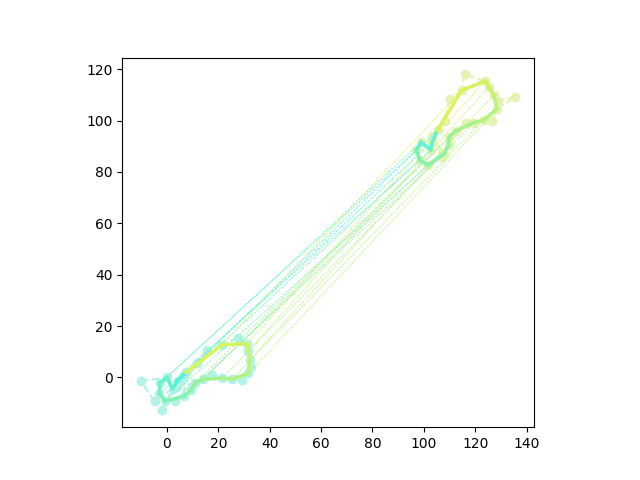

<center><font size = 6> Voting Tree</font></center>
<center><font size = 5> Date: 2022-10.27</font></center>
<center><font size = 5> Author: **</font></center>


> FYA:    **If you want to run my codes, please check `Readme.md` first! You can test my code with one command only!**


# Chapter 0: Before Reading

- 当您打开这个项目时，可能会觉得有些吓人并且让您觉得困难，对此我表示抱歉，我也竭尽全力在降低报告的阅读难度。为了让这个看起来非常浪费时间的大作业更有意义一些，我选择使用它来练习一些工程技巧。在本项目中，我强迫自己使用相对规范的面向对象语义来完成这份作业，尽管它看起来并不那么优雅。
- 但是请不要为阅读一份 OOP 代码感到畏惧，它实际上非常易读，不过我将给您一些阅读建议：
  - 不用尝试去理解代码中的语法细节，而是专注于核心逻辑。OOP 可以看作一种封装风格，我也尽可能地将每一层逻辑化得尽可能简单。（如果您上过计算机概论，请回忆“抽象”的概念。）
  - 一般来说，代码编辑器都支持原型追踪，使用 `Ctrl + 左键`/`cmd + 左键` 来查看某个函数的具体内容。利用这个技巧，可以大大减小阅读代码的压力。
  - 具体来说，从 `main()` 开始阅读，看到我们创建了一个 `VotingTree` 对象，其中涉及了五个参数，追踪进去可以发现 `.h` 文件中`VotingTree` 类的原型，查看其构造器的注释以了解内容。
    - 发现我们之后使用了 `vt.xxx()`，这是调用了对象的方法，这时候追踪 `.xxx()` 可以看到 `.h` 中 `VotingTree::xxx()` 的原型，查看其注释以了解用法。如果想了解内容，请打开同名的 `.cpp` 文件，并搜索 `VotingTree::xxx()` 以查看方法的具体实现。其他类的方法也可以用这样的方法来查看内容。
- 此外，我必须要声明，写成这样一个“庞然大物”并非是我想“卷”，而是单纯的自我赋予作业一个意义。如果您认为我的项目完成的并不好，请放心打低分；但相对应的，我不希望因为觉得“我在摁卷”而影响您的心情或是影响您的判断。
---
- I apologize that you may find this project a bit intimidating and difficult when you open it, and I have done my best to make the report less difficult to read. To make sense of what seems like a big time-wasting assignment, I chose to use it to practice some engineering skills. For this project, I forced myself to use relatively standardized object-oriented semantics to complete the assignment, even though it didn't look very elegant.
- But please don't feel intimidated by reading an OOP code, it is actually very readable, but I will give you some reading suggestions.
  - Instead of trying to understand the syntactic details of the code, focus on the core logic; OOP can be thought of as a wrapper style, and I've tried to make each layer of logic as simple as possible. (If you have taken Introduction to Computing, recall the concept of "abstraction".)
  - In general, code editors support prototype tracing, using `Ctrl + left click`/`cmd + left click` to see exactly what a function does. Using this technique, you can greatly reduce the stress of reading code.
  - Specifically, starting with `main()`, we see that we have created a `VotingTree` object, which involves five parameters. Tracing in reveals the prototype of the `VotingTree` class in the `.h` file, and looking at the comments of its constructor to understand the contents.
    - We found that we later used `vt.xxx()`, which is a call to the object's method, at this point trace `.xxx()` to see the prototype of `VotingTree::xxx()` in `.h`, check its comments to understand the usage. To see the contents, open the `.cpp` file of the same name and search for `VotingTree::xxx()` to see the specific implementation of the method. Methods of other classes can also be used in this way to see the content.
- Also, I have to state that I did not write this "behemoth" because I wanted to "roll it up", but simply to give a meaning to the assignment by myself. If you think my project is not well done, please feel free to give it a low grade; however, I do not want to affect your mood or influence your judgment by thinking that "I'm competing blindly".


# Chapter 1: Introduction

## 课题摘要 | Project Abstract

> 在这道题中，输入中将给出两组 **<u>有序点集¹</u>**，每个集合中的元素将被依次给出——在每个集合中第 $i$ 个被给出的点将被命名为 $i$ 。我们需要在点集中找到满足 **<u>单调约束条件³</u>** 的 **<u>公共子图形²</u>**。
>
> 值得一提的是，在我看来 Voting Tree 真正的奥妙之处在于它能够处理**<u>局部特征保留的形变物体</u>**，这一点我会在 Test Case Section D 做一些尝试。但是就这个目的而言，这个项目还不是个完整的项目，它存在一些缺陷，我会在 Section D 详细阐述这个缺陷。

---

> In this problem, the input will contain two groups of **<u>Ordered Point Set¹</u>**. Each element of each set will be given one by one, and the $i^\text{th}$ point will be named $i$ . What we should do is to find out the **<u>Common Subgraph²</u>** that fits **<u>Monotone Constraint³</u>**
>
> It is worth mentioning that the real beauty of the Voting Tree, in my opinion, is its ability to handle **<u>locally feature-preserving deformed objects</u>**, which I will try out in Test Case Section D. However, for this purpose, this project is not a complete project, and it has some flaws, which I will elaborate in Section D.

## 概念定义 | Concept Defination

### 有序点集 | Ordered Point Set

> 本文中**<u>有序点集</u>**是指：具有<u>循环</u>的<u>先后关系</u>的<u>二维点</u>所构成的点集。即集合可以表示为一个环形数列。
>
> 再定义**<u>子有序点集</u>**为<u>保留原有关系</u>的**<u>有序点集</u>**的子集。

- 样例：下面的数列*（隐去了点的坐标）*定义了一个有九个元素的**<u>有序点集</u>**。
  - 比如， `1` 是 `2` 的前驱，是 `9` 的后继。换句话来说，`2` 是 `1` 的后继，`9` 是 `1`；


| `1`   `2`   `3`   `4`   `5`   `6`   `7`   `8`   `9` |
| --------------------------------------------------- |

- 而下面的数列是上面的那个**<u>有序点集</u>**的<u>合法子集</u>。
  - 可以证明，对于任意三个元素，他们的偏序关系都是不变的。


| `6` `9` `1` `2` `5` |
| --------------------------------------------------- |

---

> **<u>Ordered Point Set</u>** here refers to point set composed of <u>2D points</u> with <u>cyclic precedence relation</u>. That is, the set can be seen as a circular sequence as well.
>
> Than, **<u>Sub Ordered Point Set</u>** is the sub set of an **<u>Ordered Point Set</u>**. And the partial order relation shouldn't change.

- Eg. the following array*(The coordinates of the point are hidden)* defines an Ordered Point Set with 9 elements. 
  - For example, `1` is the predecessor of `2` and the successor of `9`. In other words, `9` is the predecessor of `1` and `2` is the successor of `1`.

| `1`   `2`   `3`   `4`   `5`   `6`   `7`   `8`   `9` |
| --------------------------------------------------- |

- The array bellow is the <u>legal sub set</u> of the above <u>Ordered Point Set</u>.
  - It can be proved that, for any three elements, their partial order relation remains unchanged.

| `6` `9` `1` `2` `5` |
| ------------------- |


### 公共子图形 | Common Subgraph

> 本文中**<u>图形</u>**的定义指一个由**<u>有序点集¹</u>**中的元素依次连接形成的曲线，并且满足 $(1)$ 式，不要求闭合，但要求任意点仅连接两条边、任意边仅连接两个点。
>
> 而**<u>子图形</u>**则指的是由**<u>子有序点集¹</u>**定义的**<u>图形</u>**。
>
> 而**<u>公共子图形</u>**，则指的是能够**<u>匹配⁴</u>**的两个**<u>有序点集¹</u>**定义的**<u>子图形</u>**（这意味着**<u>公共子图形</u>**实际上是一对**<u>子图形</u>**）。
>
> - 例如：在 *figure 1.1*中，配对的连线部分为两个**<u>有序点集¹</u>**的**<u>公共子图形</u>**。

---

> **<u>Graph</u>** here refers to a curve formed by the sequential connection of elements in an **<u>Ordered Point Set¹</u>**. And the graph should meets formula $(1)$. It needn't to be closed, but any two points have and only have one common edge, while any two edges have and only have one common point.
>
> And the **<u>Subgraph</u>** refers to a **<u>Graph</u>** defined by a **<u>Sub Ordered Point Set¹</u>**.
>
> Then, the **<u>Common Subgraph</u>** refers to the **<u>Matched⁴</u>** **<u>Subgraphs</u>**(that is, **<u>Common Subgraph</u>** is a pair of **<u>Subgraphs</u>**) of two **<u>Ordered Point Sets¹</u>**.

> - For example, in *figure 1.1*, the pair of solid curves is the **<u>Common Subgraph</u>** of two **<u>Ordered Point Sets¹</u>**. 

---
$$
Points.size = Edge.size
$$

<center>
    
    <br>
    <div style="color:orange; border-bottom: 1px solid #d9d9d9;
    display: inline-block;
    color: #999;
    padding: 2px;">figure 1.1</div>
</center>


### 单调约束条件 | Monotone Constraint

> **<u>单调约束条件</u>**指**<u>公共子图形²</u>**结果需要在下标数对在根据 A 图索引进行单调递增（单调递减）排序后，满足 B 图索引也单调递增（单调递减）。而这里的单调定义在**<u>有序点集¹</u>**的偏序关系下。

---

> **<u>Monotone Constraint</u>** means that, after sorting the match pairs from the **<u>Common Subgraph²</u>** by the index of **<u>Graph²</u>** A's as as monotonically increasing(decreasing), the index of **<u>Graph²</u>** B's should also be monotonically increasing(decreasing). The "monotone" here is under the defination of **<u>Ordered Point Set's¹</u>** partial order relation.

### 匹配 | Match

> 首先我们需要定义几个参数，这些参数的具体取值在运行前是可以修改的，在运行时是固定的。（如果您认为不理想，可以尝试**在接口外部**修改这些常数。）
> |参数名| 描述 | 本文采用值 A |本文采用值 B |
> |-|-|-|-|
> |角容差|能够接受的角度绝对误差。| 0.1 |0.1 |
> | 边长比容差 |能够接受的变长比值的绝对误差。| 0.1|0.1 |

> 接下来，我们定义，如果**<u>图形²</u>** A 和**<u>图形²</u>** B 满足式 $(2)$，则称**<u>图形²</u>** A 和**<u>图形²</u>** B **<u>匹配</u>**。


---

> First we should give several params, which can be modified before running but is constant in runtime. (If you thought the matching result is not ideal, try to modify these params **outside of the API**.)
> |Param's Name| Description| Adopted  A | Adopted B |
> |-|-|-|-|
> |Angle Tolerance|The acceptable absolute error of angle.|0.1|0.1|
> |Edge Ratio Tolerance|The acceptable absolute error of ratio of two ordered edges.|0.1|0.1|

> Then we define, if **<u>Graph</u>** A and **<u>Graph</u>** B meet the formula $(2)$, we say **<u>Graph</u>** A and **<u>Graph</u>** B is **<u>matched</u>**.

---

$$
\begin{aligned}
1.\;\; & \text{Operation on index here is defined in an circular queue, that is}\\
& 0-1 = n,\;\; n+1 = 0 ,\;\; \text{where } n \text{ is the number of the points in a graph. }\\\\

2.\;\; & \text{Note graph } A \text{ and graph } B \text{ as } A\{A_1 \rightarrow A_2 \rightarrow ... \rightarrow A_n \rightarrow A_1\} \\
& \text{and } B\{B_1 \rightarrow B_2 \rightarrow ... \rightarrow B_ n \rightarrow B_1\} \text{ , } \text{ and } A_i = \left[
																																\begin{array}{c}
																																	x_i \\
																																	y_i
																																\end{array}
																															\right] \text{ , } \\
& B_i = \left[
	\begin{array}{c}
		u_i \\
		v_i
	\end{array}
\right] \text{ . }\\
& \text{Both } A_i \text{ and } B_i \text{ is called a \textit{point}. }\\\\

\text{If: }\;\; &\exist \; offset = constant,\;\; s.t. \;\; \forall \; 1\leq i,j \leq n ,\;\; \\
	& \left\{\begin{array}{l}
		&dis(i,j) = offset\text{, }\\
		&\big|\angle A_{i} - \angle B_{j} \big| < \text{ Angle Tolerance, }\\
		&\big|\frac{|{A_{i-1}A_{i}}|}{|A_{i}A_{i+1}|} - \frac{|{B_{i-1}B_{i}}|}{|B_{i}B_{i+1}|} \big| < \text{ Edge Ratio Tolerance. }
	\end{array}\right.\\\\
\text{Where: }& dis(i,j) = i-j,\\
& \angle P_i = \arccos\left( \frac{|A_{i-1}A_{i}|^2+|A_{i}A_{i+1}|^2-|A_{i-1}A_{i+1}|^2}{2\cdot|A_{i-1}A_{i}|\cdot|A_{i}A_{i+1}|} \right).\\\\
\text{Then: } & \text{we say they are matched.}
\end{aligned}
$$

## 输入数据规约 | Input Data Statute

> 本文中我设置了若干测试集，他们都有一定的特征，这些将在 Chap 3. 详细介绍，但是他们有一些共同的约束，在此说明。
>
> 除却点过少点情况，我们期望输入的数据存在肉眼可见的匹配趋势，即我们不喜欢得到一片杂乱的点集，然后从中匹配出意料之外的结果；我的数据生成工具将生成接近单不一定相同的数据，并从中能够找到受到扰动后依然能匹配上的部分。
>
> 此外，考虑到此算法的应用场景，例如几何图形形变过程中的特征追踪、物体识别定位过程中的特征识别等，我们并不定义输入杂乱的数据时的异常行为。

---

> In this paper I set up several test sets, all of them with certain characteristics that will be described in detail in Chap 3. but they have some common constraints that are described here.
>
> Except for the case of too few points, we expect the input data to have a naked-eye matching trend, i.e., we do not like to get a jumbled set of points and then match unexpected results from it; my data generation tool will generate data that are not necessarily identical close to a single and from which we can find parts that still match after being perturbed.
>
> In addition, considering the application scenarios of this algorithm, such as feature tracking during geometry deformation, feature identification during object recognition and localization, we do not define the abnormal behavior when inputting cluttered data.


# Chapter 2: Algorithm Specification

## 流程和结构 | Flow & Structure

### 流程图 | Flowchart


### 类图 | Class Diagram


## 核心逻辑解析 | Core Function Analysis

> 抛开庞大的 OOP 结构，核心逻辑就只有 **<u>1.根据两个点集进行投票</u>** 和 **<u>2.根据投票表得到最佳匹配</u>** 这两个步骤。
---
> Despite the huge OOP structure, the core logic has only two part: **<u>1. Vote according to two point sets</u>** and **<u>2. Get the best match according to the voting table</u>**.

---

> 此外，类似的，我们还将给出几个常数的定义，这些参数的具体取值在运行前是可以修改的，在运行时是固定的。（如果您认为不理想，可以尝试**在接口外部**修改这些常数。）
> | 参数名               | 描述                                                         | 本文采用值 |
> |-|-|-|
> |可信下界| 能够被认为是合法的最小的点的数量 |5|
---
> 此外，类似的，我们还将给出几个常数的定义，这些参数的具体取值在运行前是可以修改的，在运行时是固定的。（如果您认为不理想，可以尝试**在接口外部**修改这些常数。）
> | Param's Name   | Description                                           | Adopted |
> |-|-|-|
> |Credible Lower Limit(CLL)| The minimum number of points that can be considered legitimate. |5|

### 使用递归搜索进行投票 | Vote Through DFS

> - 这一部分逻辑的位置为 `src/solver/optimal_match/voting_tree.cpp` / `VotingTree::voteByDfs()` 
> - The location of this part of the logic is `src/solver/optimal_match/voting_tree.cpp` / `VotingTree::voteByDfs()` 

#### 解释 | Explaination

> 首先我们介绍最朴素的思路，即枚举所有可能的匹配策略，并判断他们是否可行。最终将按照一定规则，对所有可行策略涉及的点进行“Vote”，也就是加上加权赋分。
>
> 那么何为“匹配策略”呢？
>
> - 首先我们定义“匹配策略”，我们要寻找的是点对关系，例如 $\{(A_{i_1},B_{j_1}), (A_{i_2},B_{j_2}),...,(A_{i_k},B_{j_k})\}$ 为一种匹配策略，它表示 $A$ 图中的这 $k$ 个点和 $B$ 图中的这 $k$ 个点依次匹配。
>
> 那么怎么样的“匹配策略”会被我们采纳呢？
>
> - 为们称由$\{A_{i_1}, A_{i_2}, ..., A_{i_k}\}$ 构成的**<u>有序点集²</u>**和 $\{B_{i_1}, B_{i_2}, ...B_{i_k}\}$ 构成的**<u>有序点集²</u>** **<u>匹配⁴</u>**，且 $offset = 0$ 时， 策略 $\{(A_{i_1},B_{j_1}), (A_{i_2},B_{j_2}),...,(A_{i_k},B_{j_k})\}$ 是可以被接纳的。
>
> 很显然，如果$A$ 图有 $n$ 个点，$B$ 图有 $m$ 个点，则一共有 $\sum_{i=CLL}^{min(n,m)}i\cdot C_{n}^{i}C_{m}^{i}$，可以发现这是个非常恐怖的数，所以我们需要做一些优化，优化后的流程大致如下。
>
> - 枚举策略：
>
>     - 我们从 $A$ 的可枚举范围内枚举一个点，从 $B$ 的可枚举范围内枚举一个点，将他们作为路径中的一个配对，即创建了当前策略的一个子可能树；
>    - 接下来将这个点当作当前路径，去枚举生成下一个子可能树；
> 
> - 枚举范围：
>
>     - 对于 $A$ 和 $B$ 采取不同的范围界定策略，目的是减少枚举可能同时保证结果对称、非重、完备。
>    - 对于 $A$，如果某个点做过且做完了可能树的根节点，那么不再参与后续的枚举（也就是说，例如在枚举过所有以 $(A_1,B_i),i\in\{1,2,...,m\}$ 为根的可能树后，点 $A_i$ 就不再参与后续枚举）；此外，如果 $A_p$ 已经在枚举路径中出现过，它理所当然的也不能参与这条路径接下来的枚举；
>     - 对于 $B$，我们只判断它是否在已经选中的当前路径中，如果已经被选中，则不参与，反之可以参与枚举；
>     - 如果用图标来描述，那大致如下，从图中可以发现对 $A$ 和 $B$ 处理的区别：
>       - 绿色表示接下来可以选中的部分，红色表示无论如何之后都不会再选中的部分，深灰表示当前枚举路径中的部分，浅灰表示枚举过了，被跳过的部分；
> 
> <center>
>         box-shadow: 0 2px 4px 0 rgba(34,36,38,.12),0 2px 10px 0 rgba(34,36,38,.08);" 
>     src="img/Figure_2.png">
>         <br>
>     <div style="color:orange; border-bottom: 1px solid #d9d9d9;
>     display: inline-block;
>     color: #999;
>     padding: 2px;">figure 2.1</div>
> </center>
> <center>
>          box-shadow: 0 2px 4px 0 rgba(34,36,38,.12),0 2px 10px 0 rgba(34,36,38,.08);" 
>     src="img/Figure_3.png">
>     <br>
>     <div style="color:orange; border-bottom: 1px solid #d9d9d9;
>     display: inline-block;
>     color: #999;
>     padding: 2px;">figure 2.2</div>
> </center>
> 
> -  计数（投票）策略：
>
>    -  朴素的思路是将每一条路径都单独搜索计数，但是现在我们显然可以在搜索过程中，进行一个“滞后返回”的操作。即，如果当前路径是合法的，我们先存储这个结果，并先统计它能够派生出来的可能性的分数，得到和分数以后再返回。
>

---

> First, we introduce the most simple idea, which is to enumerate all possible matching strategies and determine whether they are feasible or not. Finally, all the points involved in the feasible strategies are "Vote" according to certain rules, i.e., a weighted score is added.
>
> So what is a "matching strategy"?
>
> - First we define the "matching strategy", we are looking for a point-to-point relationship, for example $\{(A_{i_1},B_{j_1}), (A_{i_2},B_{j_2}),... ,(A_{i_k},B_{j_k})\}$ is a matching strategy, which means that these $k$ points in the $A$ graph are matched with these $k$ points in the $B$ graph in turn.
>
> So what kind of "matching strategy" will be adopted?
>
> - We call the set of $\{A_{i_1}, A_{i_2}, ... , A_{i_k}\}$ consisting of **<u>Ordered Point Set²</u>** and $\{B_{i_1}, B_{i_2}, . .B_{i_k}\}$ constitutes an **<u>Ordered Point Set²</u>** **<u>Matching⁴</u>** and $offset = 0$, the strategy $\{(A_{i_1},B_{j_1}), (A_{i_2},B_{j_2}),... ,(A_{i_k},B_{j_k})\}$ is admissible.
>
> Obviously, if the $A$ graph has $n$ points and the $B$ graph has $m$ points, then there is a total of $\sum_{i=CLL}^{min(n,m)}i\cdot C_{n}^{i}C_{m}^{i}$, which can be found to be a very scary number, so we need to do some optimization, and the optimized process is roughly as follows.
>
> - Enumeration strategy.
>
>   - We enumerate a point from the enumerable range of $A$ and a point from the enumerable range of $B$ and treat them as a pair in the path, i.e. a subpossibility tree of the current strategy is created.
>   - next enumerate this point as the current path to generate the next subpossibility tree.
>
> - Enumeration range.
>
>   - Different scoping strategies are adopted for $A$ and $B$, with the aim of reducing the enumeration possibilities while ensuring symmetric, non-duplicative, and complete results.
>   - For $A$, if a point has done and finished the root of the possible tree, then it will not participate in the subsequent enumeration (i.e., for example, after enumerating all nodes with $(A_1,B_i),i\in\{1,2,...,m\}$ as root, the point $A_i$ does not participate in subsequent enumeration); moreover, if $A_p$ has already appeared in the enumeration path, it is logical that it cannot participate in the next enumeration of this path either.
>   - For $B$, we only determine whether it is in the current path that has already been selected, and if it has already been selected, then it does not participate, and if not, it can participate in the enumeration.
>   - If we describe it with icons, it is roughly as follows, from which we can find the difference between the treatment of $A$ and $B$.
>     - green indicates the part that can be selected next, red indicates the part that will not be selected again afterwards anyway, dark gray indicates the part in the current enumeration path, and light gray indicates the part that has been enumerated and skipped.
>   

> <center>
>   box-shadow: 0 2px 4px 0 rgba(34,36,38,.12),0 2px 10px 0 rgba(34,36,38,.08);" 
>  src="img/Figure_2.png">
>      <br>
>  <div style="color:orange; border-bottom: 1px solid #d9d9d9;
>  display: inline-block;
>  color: #999;
>  padding: 2px;">figure 2.1</div>
> </center>
> <center>
>    box-shadow: 0 2px 4px 0 rgba(34,36,38,.12),0 2px 10px 0 rgba(34,36,38,.08);" 
>  src="img/Figure_3.png">
>  <br>
>  <div style="color:orange; border-bottom: 1px solid #d9d9d9;
>  display: inline-block;
>  color: #999;
>  padding: 2px;">figure 2.2</div>
> </center>
> Counting (voting) strategy.
>
> - The plain idea is to search for each path individually and count it, but now we can obviously do a "lag return" operation during the search. That is, if the current path is legal, we first store the result and count the number of possibilities it can derive, and then return it after getting the sum score.

---

#### 伪代码 | Pseudocode

```cpp
// The real code will be more complex, because there are many boundary details
// to deal with.
deepFirstSearchForNextMatchPair(){
  	// Get the current path's score.
  	if(current is legally matched){
      	returnScore = calculateSuccessScore();
    } else {
      	// If current is not mathed, then it has no derivation strategies.
      	return calculateFailScore();
    }
    // Iterate the derivation strategies.
		for(usable Ai, usable Bi){
  			// We should store the current stage so that we could iterate the 
  			// next match without the influence from the last one.
				storeCurrentStage();
  			// This step is just like go to the son fo the current node in
  			// possibility tree.
				returnScore += deepFirstSearchForNextMatchPair();
  			// We use the things stored before search to recover the stage.
				recoverCurrentStage();
		}
  	return returnScore;
}
```

---

#### 样例解释 | Example

> 为了更好的说明，我将举一个例子。
>
> - 如下为一个 $A$  和 $B$ 中各自有 4 个点的所有可能树（省略了一部分形状相同的），由于点数过少，在此样例中，我们使用的 Credible Lower Limit(CLL) 为 3。
>

---

> To better illustrate, I will give an example.
>
> - Here are all possible trees with 4 points each in $A$ and $B$ (omitting some of the ones with the same shape), and in this example we use a Credible Lower Limit (CLL) of 3 because of the small number of points.

> ```mermaid
>graph TD;
> 
>A("(1,1)")
> A --- B("(2,2)")
> A --- C("(2,3)")
> A --- D("(2,4)")
> A --- E("(3,2)")
> A --- F("(3,3)")
> A --- G("(3,4)")
> A --- H("(4,2)")
> A --- I("(4,3)")
> A --- J("(4,4)")
> 
> B --- K("(3,3)")
> B --- L("(3,4)")
> B --- M("(4,3)")
> B --- N("(4,4)")
> 
>    C --- O("(3,4)")
> C --- P("(4,4)")
> 
> E --- R("(4,3)")
> E --- S("(4,4)")
> 
> F --- T("(4,4)")
> 
> K --- U("(4,4)")
> 
> AA("(1,3)") --- BB("...")
> ```
> 
>    ```mermaid
> graph TB;
> A("(1,2)")
>A --- B("(2,3)")
> A --- C("(2,4)")
> A --- D("(2,1)")
> A --- E("(3,3)")
> A --- F("(3,4)")
> A --- G("(3,1)")
> A --- H("(4,3)")
> A --- I("(4,4)")
> A --- J("(4,1)")
> 
> B --- K("(3,4)")
> B --- L("(3,1)")
> B --- M("(4,4)")
> B --- N("(4,1)")
> 
> C --- O("(3,1)")
> C --- P("(4,1)")
> 
> E --- R("(4,4)")
> E --- S("(4,1)")
> 
> F --- T("(4,1)")
> 
> K --- U("(4,1)")
> 
> AA("(1,4)") --- BB("...")
>    ```
> 
>    ```mermaid
> graph TD;
> 
>A("(2,1)")
> A --- B("(3,2)")
>    A --- C("(3,3)")
> A --- D("(3,4)")
> A --- E("(4,2)")
>    A --- F("(4,3)")
> A --- G("(4,4)")
> 
>    B --- H("(4,3)")
> B --- I("(4,4)")
> 
> C --- J("(4,4)")
> 
> AA("(2,3)") --- BB("...")
>    ```
> 
>    ```mermaid
> graph TD;
> A("(2,2)")
>A --- B("(3,3)")
> A --- C("(3,4)")
> A --- D("(3,1)")
> A --- E("(4,3)")
> A --- F("(4,4)")
>    A --- G("(4,1)")
> 
> B --- H("(4,4)")
>    B --- I("(4,1)")
> 
>    C --- J("(4,1)")
> 
> AA("(2,4)") --- BB("...")
>    ```
> 
> ```mermaid
> graph TD;
> A("(3,1)")
>A --- B("(4,2)")
> A --- C("(4,3)")
> A --- D("(4,4)")
> 
> AA("(3,2)")
> AA --- BB("(3,3)")
> AA --- CC("(3,4)")
> AA --- DD("(3,1)")
> 
> a("(3,3)")
> a --- b("(4,4)")
> a --- c("(4,1)")
> a --- d("(4,2)")
> 
> aa("(3,4)")
> aa --- bb("(4,1)")
> aa --- cc("(4,2)")
> aa --- dd("(4,3)")
> ```
> 
> - 可以发现，这片可能性森林中，有非常多的路径，即使在 $CCL = 4$ 的约束下，也仍然还有很多路径是能被保留下来的。但是他们中的很多会在“匹配”的条件上失败，一旦失败，其派生都不会存在。
> - 现在借助这张图，我们在流程上对其进行一个模拟，就以 $\{(1,1)\rightarrow(2,2)\rightarrow(3,3)\rightarrow(4,4)\}$ 为例，我们假设他们都是匹配的，那么这条路线的模拟如下：
>   - 枚举根，以 $(1,1)$ 为根；
>     - 点数不足三个点，无条件匹配；
>      - 点数不足，匹配成功得分为 $0$；
>      - 派生，进入子节点；
>      - 枚举第二个点 $(2,2)$ ；
>         - 点数不足三个点，无条件匹配；
>         - 点数不足，匹配成功得分为 $0$；
>         - 派生，进入子节点；
>         - 枚举第三个点 $(3,3)$；
>           - 点数满足三个，开始匹配，发现 $\triangle A_1A_2A_3$ 同 $\triangle B_1B_2B_3$ 匹配；
>           - 匹配成功，暂存得分为 $p$；
>           - 派生，进入子节点；
>           - 枚举第四个点 $(4,4)$；
>             - 点数满足三个，开始匹配，发现 $\triangle A_2A_3A_4$ 同 $\triangle B_2B_3B_4$ 匹配；
>             - 匹配成功，暂存得分为 $q$；
>             - 派生，进入子节点；
>             - 枚举第五个点；
>               - 不存在派生，匹配失败；
>               - 返回得分 $0$；
>             - 计算累计得分 $q+0=q$；
>             - `votingTable[4][4] += q;`
>             - 返回得分 $q$；
>           - 计算累计得分 $p+q=p+q$；
>           - `votingTable[3][3] += p+q;`
>           - 返回得分 $p+q$；
>         -  计算累计得分 $p+q+0=p+q$；
>         -  `votingTable[2][2] += p+q;`
>         -  返回得分 $p+q$；
>      - 计算累计得分 $p+q+0=p+q$；
>      - `votingTable[1][1] += p+q;`
>      - 返回得分 $p+q$；
>   - 结束；
> 
---

> - It can be seen that there are so many paths in this forest of possibilities that even under the $CCL = 4$ constraint, there are still many paths that can be preserved. But many of them will fail in the "matching" condition, and once they fail, none of their derivations will exist.
> - Now, with the help of this graph, let's make a simulation of it in terms of the flow. Let's take $\{(1,1)\rightarrow(2,2)\rightarrow(3,3)\rightarrow(4,4)\}$ as an example, and let's assume that they all match, then the simulation of this route is as follows.
>   - Enumerating the root, with $(1,1)$ as the root.
>     - less than three points, unconditional matching.
>     - insufficient number of points, with a successful match score of $0$.
>     - Derivation, into child nodes.
>     - Enumerate the second point $(2,2)$.
>       - unconditional match for less than three points.
>       - insufficient points, successful match scores $0$.
>       - derive, into the child node.
>       - enumerate the third point $(3,3)$.
>         - Matching starts when the number of points meets three, and $\triangle A_1A_2A_3$ is found to match with $\triangle B_1B_2B_3$.
>         - Match is successful, staging score is $p$.
>         - Derivation, into child nodes.
>         - Enumerate the fourth point $(4,4)$.
>           - The number of points satisfies three, start matching, find $\triangle A_2A_3A_4$ matching with $\triangle B_2B_3B_4$.
>           - Match is successful and the staging score is $q$.
>           - Derivation, into child nodes.
>           - Enumerate the fifth point.
>             - no derivation, match fails.
>             - return score $0$.
>           - calculate cumulative score $q+0=q$.
>           - `votingTable[4][4] += q;`
>           - return score $q$.
>         - Calculate the cumulative score $p+q=p+q$.
>         - `votingTable[3][3] += p+q;`
>         - return score $p+q$.
>       - Calculate the cumulative score $p+q+0=p+q$.
>       - `votingTable[2][2] += p+q;`
>       - return score $p+q$.
>     - Calculate the cumulative score $p+q+0=p+q$.
>     - `votingTable[1][1] += p+q;`
>     - return the score $p+q$.
>   - Ending.

### 从表中得到匹配关系 | Get Match Relationship From Table

> - 这一部分逻辑的位置为 `src/solver/optimal_match/voting_tree.cpp` / `VotingTree::matchAccordingTalbe()`
> - The location of this part of the logic is `src/solver/optimal_match/voting_tree.cpp` / `VotingTree::matchAccordingTalbe()`

#### 解释 | Explaination

> 在上一个步骤中，我们已经得到了一张二维表，其两个维度分别对应两个**<u>有序点集¹</u>**的每个点。其值表示在匹配过程中得到的累计得分。
>
> 我们首先分析一下这个得分的大小意味着什么。
>
> 假设每一次被搜到，我们都会让路径上的值 `+1`，即权重都是相等的，那么不难发现，表中每一格的值正比于**<u>存在这个点的匹配路径数</u>**。更近一步的，对于一条长度大于 $CLL$ 的可行路径，其每一条长度大于 $CLL$ 的连续子路径都可以被视为一个可行路径。(而实际上这一步也在上一步通过“滞后”处理被优化为回溯处理，降低了时间复杂度) 因此我们能得到这样一个结论，在数据规模足够大的情况下，“匹配上”的节点在表中的数值一定占有很高的优势，亦即数值上会存在明显的突变，明显到你一眼就能区分出来哪些是匹配的，哪些是不匹配的。当然，这个结论非常的不严谨，因为我们有一些措施可以让这种突变的优势变得不那么明显，但是这种界定难度和通过视觉途径在点集中进行识别的难度是对等的。所以我们并不考虑这种情况。
>
> 那么，我们就可以设置一个阈值，高于这个阈值的点被认为是可以匹配上的，而低于这个阈值的则被认为是失配的。
>
> 而在我的代码中，我选择的是表中两个最值的和的 0.3 倍。由于在我们能够接受的情况下，能够匹配上的点具有相当的优势，且实际上这种界定方法在特征数据下表现良好。
>
> >  事实上，有更合理的做法，但是由于时间关系和体量关系，我只给出一个简单的描述但并不计划实现：通过绘制排序后的表格值的邻域方差函数，通过突变点可以找到表中数据的若干“团”，或者说台阶，再通过这些台阶来处理。
>
> 在得到这个界定规则后，我们就可以开始来寻找这些点了。
>
> 这里需要注意的一点就是需要让找出来的点满足**<u>单调约束条件³</u>**，这要求我们体感上从一张循环到表的左上找到右下。
>
> 假设如 `figure 2.3` 为我们得到的一张 4*4 的 VotingTable，那么我们能找到的就是这张“循环”表中的蓝色部分。可以发现，他们在循环表示中满足“总左上到右下”的结果。而在实际搜索过程中，它是按照红框的方式被找到的。
>
> 那么实际上，我们在处理过程中也要模仿这个表格的扩展，通过将一个表格通过四个循环，来实现循环意义下的“从左上到右下”的搜索。详细内容可以查看伪代码。
>
> 此外，由于在复杂情况下，表单的情况可能很复杂，所以我们需要“枚举”起点，并从中找到最长的一条结果。

----

> In the previous step, we have obtained a two-dimensional table whose two dimensions correspond to each point of the two **<u>Ordered Point Sets¹</u>**. Its value represents the cumulative score obtained during the matching process.
>
> We first analyze what the magnitude of this score implies.
>
> Assuming that each time we are searched, we let the values on the paths `+1`, i.e., the weights are all equal, it is easy to see that the value of each cell in the table is proportional to the number of **<u>matching⁴</u>** paths where this point exists. Closer to home, for a feasible path of length greater than $CLL$, each of its consecutive subpaths of length greater than $CLL$ can be considered as a feasible path. (In fact, this step is also optimized in the previous step by "hysteresis" processing, which reduces the time complexity). In other words, there will be obvious mutations in the values, so obvious that you can distinguish at a glance which ones are matches and which ones are not. Of course, this conclusion is very uncritical, because we have some measures to make this mutation advantage less obvious, but the difficulty of defining this is equivalent to the difficulty of identifying it in the point set by visual means. So we do not consider this case.
>
> Then, we can set a threshold above which points are considered to be matchable, and below which they are considered to be mismatched.
>
> And in my code, I choose the median of the two most values in the table. Since the points that can match up have a considerable advantage in the case we can accept, and actually this definition method performs well with the feature data.
>
> >  In fact, there is a more reasonable approach, but due to time and volume, I will only give a simple description but do not plan to implement it: by plotting the neighborhood variance function of the sorted table values, a number of "clusters", or steps, of data in the table can be found by mutation points, and then processed by these steps.
>
> After getting this definition rule, we can start to find these points.
>
> One thing to keep in mind here is that the found points need to satisfy the **<u>Monotonicity Constraint³</u>**, which requires us to physically go from a loop to the top left of the table to the bottom right.
>
> Assuming that `figure 2.3` is a 4*4 VotingTable, then all we can find is the blue part of this "loop" table. You can see that they satisfy the "total top-left to bottom-right" result in the loop representation. And in the actual search process, it is found according to the red box.
>
> In fact, we have to mimic the extension of this table in the process, by passing a table through four loops to achieve the "top left to bottom right" search in the sense of a loop. Details can be seen in the pseudo-code.
>
> In addition, since the form can be very complex in complex cases, we need to "enumerate" the starting point and find the longest result from it.

---

<center>

  <br>
<div style="color:orange; border-bottom: 1px solid #d9d9d9;
display: inline-block;
color: #999;
padding: 2px;">figure 2.3</div>
</center>


#### Bonus

> 另一个做法是，首先排序表中的所有元素，然后从大到小挑选出在表格中不在同一行且不在同一列，亦即不冲突的匹配。再将这些挑选出来的策略按照第一个元素进行排序，再求出第二个元素不下降的子序列即可，这里使用带路径存储的 LIS 算法来实现。

---

> Another approach is to first sort all the elements in the table, and then pick from largest to smallest matches that are not in the same row and not in the same column in the table, i.e. non-conflicting matches. Then sort these selected strategies according to the first element, and then find the subsequence whose second element does not descend. Here, the LIS algorithm with path storage is used to realize it.

#### 伪代码 | Pseudocode

```cpp
matchAccordingTalbe{
		threshold = (min_elements + max_elements) * 0.3;
    // Iterate the bound of the first Ai, in order to search the best answer.
    for(bound in Ai){
      	// Left-Top part in extended table.
      	for(Ai in [bound, n], Bj in (last_j, m]){
          	if(vt[Ai][Bj] > threshold){
              	if(Ai is first_i) first_i = Ai;
              	if(Bj is first_j) first_j = Bj;
              	last_j = Bj;
              	push (Ai, Bj) into current strategy;
            }
        }
      	// Left-Bottom part in extended table.
        for(Ai in [0, bound), Bj in (last_j, m]){
          	if(vt[Ai][Bj] > threshold){
              	if(Ai is first_i) first_i = Ai;
              	if(Bj is first_j) first_j = Bj;
              	last_j = Bj;
              	push (Ai, Bj) into current strategy;
            }
        }
      	// Right-Top part in extended table.
        for(Ai in [bound, min(first_i, n)], Bj in [0, first_j]){
          	if(vt[Ai][Bj] > threshold){
              	last_j = Bj;
              	push (Ai, Bj) into current strategy;
            }
        }
      	// Right-Bottom part in extended table.
        for(Ai in [0, min(bound, first_i)], Bj in (last_j, first_j]){
          	if(vt[Ai][Bj] > threshold){
              	last_j = Bj;
              	push (Ai, Bj) into current strategy;
            }
        }
				// Judge and store.
        if(current_strategy meets requirement and is better than current_optimal_solution){
          	current_optimal_solution = current_strategy;
        }
    }
  	if(has solution){
      	return current_optimal_solution;
    }
}
```

- Bounus

```cpp
// Detail comments are in `.h` file!
matchAccordingTalbe(){
    sort the elements in table;
    average = (min_element + max_element)/2;
    for(i){
        if(elements[i] < ave) break;
        auto cur = vec[i];
        if(x[i] and y[i] is not used){
            set x[i] and y[i] used;
            store x[i] and y[i] to the current solution;
        }
    }
    // Sort it in accressment order.
    sort_the_elements_in_current_solution;
    check_order_using_LIS();
    if(current_solution is not big enough)
        clear current_solution;
    return;
}

LIS(){
    d[1] = a[1];
    for(i){
        if(a[i] > d[len]) d[++len] = a[i];
        else if(a[i] <= d[len]){
            int pos = lower_bound(d+1,d+len+1,a[i]) - (d+1) + 1;
            d[pos] = a[i];
        }
    }
}
```


# Chapter 3: Testing Results

> I prepare 4 sections of test cases, their discription is also in `seciont_?/Readme.md`.
>
> Also, if you want to test my code your self, just follow the instruction in `./Readme.md`.
>
> If you want to change the size of test cases, check the `main()` in each seciton's `maker.cpp`.

## Section A (Pass)

> ### 描述
>
> - 本部分数据将满足以下条件：
>     1. B 中的“图形”由 A 中的“图形”通过刚性变化得到，即只有整体缩放、旋转、翻转；
>     2. 不存在噪点；
>     3. 以上条件意味着，在此部分数据中，A 和 B 中点的数量应当是相同的。
>
> ### 数据范式
>
> `.in` 文件中
>
> - 第一行为一个整数 T，表示有 T 组测试数据；
> - 接下来为 T 组数据：
>   - 每组第 1 行为一个整数 m，表示 A 中有 m 个点；
>   - 每组第 2 ~ m+1 行，每行有两个浮点数 x 和 y，表示每个点的坐标；
>   - 每组第 m+2 行为一个整数 n，表示 B 中有 n 个点；
>   - 每组第 m+3 ~ m+n+2 行，每行有两个浮点数 x 和 y，表示每个点的坐标；
---
> ### Description
>
> - Data made here will have following features:
>     1. Polygon in B is rigid transformed(i.e. scale, rotate and flip) from that in A.
>     2. There will be no noise.
>
> ### Data Form
>
> In `.in` file,
>
> - The first line is an integer *T*, which means there will be *T* groups of test data.
> - Then comes *T* groups of data. In each group:
>   - Line *1* contains an integer *m*, which means there are *m* points in *A*.
>   - Line *2* to line *m+1*, contains two float number *x* and *y* each line, which represents the coordinate of the point.
>   - Line *m+2* contains an integer *n*, which means there are *n* points in *B*.
>   - Line *m+3* to line *m+n+2*, contains two float number *x* and *y* each line, which represents the coordinate of the point.

### Example Test Case

#### Input

```
1
15
0 0
-2.1619 3.23308
-4.65883 6.18222
-6.87333 9.50584
-9.38755 12.3754
-13.1374 12.8433
-15.8337 10.9651
-15.4128 7.21887
-14.9022 3.47599
-13.6072 -0.289489
-12.1229 -2.80169
-7.12099 -3.35494
-2.74382 -2.81734
1.39092 -2.85288
4.06026 -0.521197
15
6.89554 1.04331
10.8328 0.722518
14.9696 1.19757
17.8691 2.14803
19.5597 7.13152
19.9958 11.7225
20.9626 15.937
19.1821 19.1877
17.7362 15.1586
13.948 13.6784
10.3743 11.7922
6.48182 10.2787
2.98554 8.35691
1.66391 4.6328
2.97508 1.45657
```

#### Output

- Time: 0.130955s

```
15
   9   2
  10   3
  11   4
  12   5
  13   6
  14   7
  15   8
   1   9
   2  10
   3  11
   4  12
   5  13
   6  14
   7  15
   8   1
```

#### Visualize

<center>

  <br>
<div style="color:orange; border-bottom: 1px solid #d9d9d9;
display: inline-block;
color: #999;
padding: 2px;">figure 3.1</div>
</center>


## Section B (Pass)

>
> ### 描述
>
> - 本部分数据将满足以下条件：
>     1. B 中的“图形”首先由 A 中的“图形”通过刚性变化得到，即只有整体缩放、旋转、翻转；
>     2. 然后对其中的点进行一定程度的扰动，即每个点都会被加上一个随机向量；
>     3. 以上条件意味着，在此部分数据中，A 和 B 中点的数量应当是相同的。
>
> ### 数据范式
>
> `.in` 文件中
>
> - 第一行为一个整数 T，表示有 T 组测试数据；
> - 接下来为 T 组数据：
>   - 每组第 1 行为一个整数 m，表示 A 中有 m 个点；
>   - 每组第 2 ~ m+1 行，每行有两个浮点数 x 和 y，表示每个点的坐标；
>   - 每组第 m+2 行为一个整数 n，表示 B 中有 n 个点；
>   - 每组第 m+3 ~ m+n+2 行，每行有两个浮点数 x 和 y，表示每个点的坐标；
>

---

> ### Description
>
> - Data made here will have following features:
>     1. Polygon in B is first rigid transformed(i.e. scale, rotate and flip) from that in A.
>     2. Then each points in B will be randomly added by a random vector.
>     3. There will be no noise.
>
> ### Data Form
>
> In `.in` file,
>
> - The first line is an integer *T*, which means there will be *T* groups of test data.
> - Then comes *T* groups of data. In each group:
>   - Line *1* contains an integer *m*, which means there are *m* points in *A*.
>   - Line *2* to line *m+1*, contains two float number *x* and *y* each line, which represents the coordinate of the point.
>   - Line *m+2* contains an integer *n*, which means there are *n* points in *B*.
>   - Line *m+3* to line *m+n+2*, contains two float number *x* and *y* each line, which represents the coordinate of the point.

### Example Test Case

#### Input

```
1
20
0 0
3.8735 -0.971065
7.59663 -1.75691
11.4904 -1.96307
14.7119 -2.28918
18.5088 -2.15542
20.7412 0.924801
21.3623 4.4359
21.3414 8.11702
18.1527 10.0807
14.793 11.958
12.465 14.7969
10.5136 17.4053
7.67017 19.3482
3.49652 18.5845
-0.311619 16.1545
-1.95097 10.7796
-3.46592 5.58175
-2.53579 0.933665
-0.407317 -2.24249
20
8.45632 15.6901
5.07948 12.7483
5.22174 8.10308
7.31208 4.34954
9.13546 0.895116
14.5875 1.47252
19.1236 2.20823
23.3988 1.27209
27.2999 0.442044
31.4646 0.78198
34.8514 4.71564
36.5399 9.88869
34.1987 16.1971
31.0235 21.4511
27.1307 25.8949
22.6251 27.1819
24.2782 24.7246
19.5973 22.6422
15.491 20.6093
11.738 17.8954
```

#### Output

- Time: 0.450951s

```
18
   6   2
   7   3
   8   4
  10   6
  11   7
  12   8
  13   9
  14  10
  15  11
  16  12
  17  13
  19  15
  20  16
   1  17
   2  18
   3  19
   4  20
   5   1
```

#### Visualize

<center>

  <br>
<div style="color:orange; border-bottom: 1px solid #d9d9d9;
display: inline-block;
color: #999;
padding: 2px;">figure 3.2</div>
</center>


## Section C (Pass)

> ### 描述
>
> - 本部分数据将满足以下条件：
>     1. B 中的“图形”首先由 A 中的“图形”通过刚性变化得到，即只有整体缩放、旋转、翻转；
>     2. 然后对其中的点进行一定程度的扰动，即每个点都会被加上一个随机向量；
>     3. 除此之外，我还会添加若干噪点，噪点的数量在原图点数的 4 倍以内；
>     4. 以上条件意味着，在此部分数据中，A 和 B 中点的数量应当是相同的；
>
> ### 数据范式
>
> `.in` 文件中
>
> - 第一行为一个整数 T，表示有 T 组测试数据；
> - 接下来为 T 组数据：
>   - 每组第 1 行为一个整数 m，表示 A 中有 m 个点；
>   - 每组第 2 ~ m+1 行，每行有两个浮点数 x 和 y，表示每个点的坐标；
>   - 每组第 m+2 行为一个整数 n，表示 B 中有 n 个点；
>   - 每组第 m+3 ~ m+n+2 行，每行有两个浮点数 x 和 y，表示每个点的坐标；

---

> ### Description
>
> - Data made here will have following features:
>     1. Polygon in B is first rigid transformed(i.e. scale, rotate and flip) from that in A.
>     2. Then each points in B will be randomly added by a random vector.
>     3. What's more, I will also add some noise points, whose number will no bigger than 4 times of that of the origin points.
>     4. There will be no noise.
>
> ### Data Form
>
> In `.in` file,
>
> - The first line is an integer *T*, which means there will be *T* groups of test data.
> - Then comes *T* groups of data. In each group:
>   - Line *1* contains an integer *m*, which means there are *m* points in *A*.
>   - Line *2* to line *m+1*, contains two float number *x* and *y* each line, which represents the coordinate of the point.
>   - Line *m+2* contains an integer *n*, which means there are *n* points in *B*.
>   - Line *m+3* to line *m+n+2*, contains two float number *x* and *y* each line, which represents the coordinate of the point.

### Example Test Case

#### Input

```
1
30
-4.78813 -9.23897
-10.1184 -1.39777
0 0
-2.76055 -2.22995
-2.89584 -6.25702
-0.618929 -9.19162
3.12962 -8.99266
6.66361 -7.29531
6.61818 0.913114
9.39695 -4.80688
3.8814 -3.57843
10.9271 -2.13634
14.0582 -0.740435
17.6601 1.00135
21.3784 -0.289846
25.3405 -0.626236
29.0519 -0.824408
31.7178 1.57485
32.9298 4.00806
32.2919 6.94522
31.6774 10.4213
31.1188 13.0164
27.6091 15.368
21.5593 12.8357
15.5189 10.8409
11.7699 5.68452
7.56068 1.9777
4.15638 -1.2014
-1.90954 -12.8046
2.2187 -4.3574
27
114.688 111.738
110.138 108.269
108.123 99.8493
105.359 96.2894
103.325 91.9661
102.64 88.4883
98.9481 91.6267
97.1282 88.5368
98.4111 84.6632
101.675 82.7073
106.935 85.727
103.356 94.0503
107.958 87.0343
109.64 90.516
109.978 93.6798
112.519 96.0167
116.275 98.8825
119.442 99.1374
123.293 100.268
126.529 99.7896
128.622 104.616
135.536 109.34
128.737 107.647
127.167 109.967
125.368 113.132
123.866 115.414
115.836 117.962
```

#### Output

- Time: 3.0127s

```
18
  27   4
  28   5
  30   6
   3   7
   4   8
   5   9
   6  10
   8  13
  10  14
  12  15
  13  16
  15  18
  16  19
  18  21
  20  24
  21  25
  22  26
  24   1
```

#### Visualize

<center>

  <br>
<div style="color:orange; border-bottom: 1px solid #d9d9d9;
display: inline-block;
color: #999;
padding: 2px;">figure 3.3</div>
</center>


## Extra: Section D (Specific Cases Pass)

> ### 描述
>
> - 本部分数据将满足以下条件：
>     1. B 中的“图形”由 A 中的“图形”通过刚性变化得到，即只有整体缩放、旋转、翻转；
>     2. B 中的图形会存在“弯折”；
>     3. 不存在噪点；
>     4. 以上条件意味着，在此部分数据中，A 和 B 中点的数量应当是相同的。
>
> - 比较遗憾的是，这里的数据测试表现并不十分理想，因为当生成的图形相当接近，可能少数几个点就会导致他们的得分产生突变，而我只有时间处理两阶的情况。如果采用我在报告中使用的“邻域方差突变检测”来找到突变点，效果会好很多，甚至能够找到有多少个特征是能够被匹配的。
>
> ### 数据范式
>
> `.in` 文件中
>
> - 第一行为一个整数 T，表示有 T 组测试数据；
> - 接下来为 T 组数据：
>   - 每组第 1 行为一个整数 m，表示 A 中有 m 个点；
>   - 每组第 2 ~ m+1 行，每行有两个浮点数 x 和 y，表示每个点的坐标；
>   - 每组第 m+2 行为一个整数 n，表示 B 中有 n 个点；
>   - 每组第 m+3 ~ m+n+2 行，每行有两个浮点数 x 和 y，表示每个点的坐标；

---

> ### Description
>
> - Data made here will have following features:
>     1. Polygon in B is rigid transformed(i.e. scale, rotate and flip) from that in A.
>     2. Polygon in B will have a "bend".
>     3. There will be no noise.
>
> - Unfortunately, the performance of the data test here is not very good, because when the generated graphs are quite close, there may be a few points that cause their scores to mutate, and I only had time to deal with the two-order case. It would have been much better to use the "neighborhood variance mutation detection" I used in the report to find the mutation points, and even to find how many features could be matched.
>
> ### Data Form
>
> In `.in` file,
>
> - The first line is an integer *T*, which means there will be *T* groups of test data.
> - Then comes *T* groups of data. In each group:
>   - Line *1* contains an integer *m*, which means there are *m* points in *A*.
>   - Line *2* to line *m+1*, contains two float number *x* and *y* each line, which represents the coordinate of the point.
>   - Line *m+2* contains an integer *n*, which means there are *n* points in *B*.
>   - Line *m+3* to line *m+n+2*, contains two float number *x* and *y* each line, which represents the coordinate of the point.

### Example Test Case

#### Input

```
1
20
0 0
-0.880566 -3.44347
0.123597 -6.60164
2.05956 -9.71649
4.63558 -11.7865
8.04324 -11.8832
10.067 -8.4219
10.0814 -4.12038
7.57 -0.107728
4.48974 2.85109
4 4
5.52782 7.47802
6.57926 10.8842
6.3526 14.6654
5.39961 18.3349
4.97481 21.7489
2.08398 22.6057
-1.14156 20.6301
-2.83159 15.1666
-2.58393 9.64338
20
40 40
43.5269 39.0981
46.7616 40.1266
49.9519 42.1095
52.072 44.7479
52.1711 48.2381
48.6259 50.3109
44.2202 50.3256
40.1103 47.7534
37.0798 44.5985
44 44
39.5406 43.5089
35.4361 42.5729
31.7026 40.1083
28.5123 36.9668
25.2715 34.5164
26.1022 31.0538
30.0274 28.9214
36.6132 30.4191
42.1159 33.9338
```

#### Output

- Time: 0.509085s

```
20
   2   2
   3   3
   4   4
   5   5
   6   6
   7   7
   8   8
   9   9
  10  10
  11  11
  12  12
  13  13
  14  14
  15  15
  16  16
  17  17
  18  18
  19  19
  20  20
   1   1
```

#### Visualize

<center>

  <br>
<div style="color:orange; border-bottom: 1px solid #d9d9d9;
display: inline-block;
color: #999;
padding: 2px;">figure 3.4</div>
</center>

## Boundary Test

### Upper bound number of matching points (Not Ideal)

> - Environment:
>   - Section C
>   - Size: 100
>
> - Result:
>   - Pass
>   - Time: 15418.6s
>
> <center>
>  box-shadow: 0 2px 4px 0 rgba(34,36,38,.12),0 2px 10px 0 rgba(34,36,38,.08);" 
> src="img/Figure_10.png">
>   <br>
> <div style="color:orange; border-bottom: 1px solid #d9d9d9;
> display: inline-block;
> color: #999;
> padding: 2px;">figure 3.5</div>
> </center>
>- As you can see, the effect is not ideal. That's because Voting Tree actually disrupted the geometric logical relationship between points. Because of the huge number of noise points, many points are matched successfully unexpectedly. Then the result becomes unacceptable.

### Lower bound number of matching points (Pass)
> Note: In order to allow the size to be 3, we should set the $CCL$ to 3 for this case.
>
> - Environment:
>   - Section A
>   - Size: 3
> - Result:
>   - Pass
>   - Time: 2.5e-05s
>
> <center>
>  box-shadow: 0 2px 4px 0 rgba(34,36,38,.12),0 2px 10px 0 rgba(34,36,38,.08);" 
> src="img/Figure_9.png">
>   <br>
> <div style="color:orange; border-bottom: 1px solid #d9d9d9;
> display: inline-block;
> color: #999;
> padding: 2px;">figure 3.6</div>
> </center>


# Chapter 4: Analysis and Comments

## Time Complexity Analysis

### 下界 | Lower Bound

> 下界情况即所有策略都失配，即每次枚举到深度为 3 时都判断失败。
>
> 假设 $A$ 图有 $n$ 个点，$B$ 图有 $m$ 个点：
>
> - 对于根 $(i, j)$，$T_{lower}(i,j) = \Omega(C_{n-i}^{3}C_{m-1}^{3})=\Omega(\frac{(n-i)(n-i-1)(n-i-2)}{1\times 2\times 3}\frac{(m-1)(m-2)(m-3)}{1\times 2\times 3})=\Omega((n-i)^3m^3)$；
> - 求和得 $\sum_{i=1}^{n}\sum_{j=1}^{m} T_{lower}(i,j) = \Omega(\sum_{i=1}^{n}\sum_{j=1}^{m}(n-i)^3m^3)=\Omega(m^4\sum_{k=0}^{n-1} k^3)=\Omega(m^4n^4)$；

---

> The lower bound case is that all strategies are mismatched, that is, each time the enumeration reaches a depth of 3, the judgment fails.
> 
> Suppose the $A$ graph has $n$ points and the $B$ graph has $m$ points:
>
> - For the root $(i, j)$, $T_{lower}(i,j) = \Omega(C_{n-i}^{3}C_{m-1}^{3})=\Omega(\ frac{(n-i)(n-i-1)(n-i-2)}{1\times 2\times 3}\frac{(m-1)(m-2)(m-3)}{1\times 2\ times 3})=\Omega((n-i)^3m^3)$.
> - Sum to get $\sum_{i=1}^{n}\sum_{j=1}^{m} T_{lower}(i,j) = \Omega(\sum_{i=1}^{ n}\sum_{j=1}^{m}(n-i)^3m^3)=\Omega(m^4\sum_{k=0}^{n-1} k^3)=\Omega(m ^4n^4)$.
>

### 上界 | Upper Bound

> 上界即 Section A 的情况，完全匹配。
>
> 假设 $A$ 图有 $n$ 个点，$B$ 图有 $m$ 个点：
>
> - 对于根 $(i,j)$，可以发现，对于 $A$ 图来说，我们只需要数从起点出发，最终到达 $A$ 图最后一个点的路径个数即可，因为任意不以最后一个点为结尾的路径，都可以扩展为到大 $A$ 的路径，而实际上这一步也会被优化进这一条扩展的路径中。所以 $T_{upper}(i,j)=\Omicron(\sum_{k=CLL-2}^{n-i-1}C_{n-i-1}^{k}C_{m-1}^{3})=\Omicron(m^3\sum_{k=CLL-2}^{n-i-1}C_{n-i-1}^k)$
> - 求和得 $\sum_{i=1}^{n}\sum_{j=1}^{m}T_{upper}(i,j) = \Omicron(m^4\sum_{i=1}^{n}\sum_{k=CLL-2}^{n-i-1}C_{n-i-1}^{k})$
>
> ---
>
> The upper bound is the case of Section A, which matches exactly.
>
> Suppose the $A$ graph has $n$ points and the $B$ graph has $m$ points:
>
> - For the root $(i,j)$, it can be found that for the $A$ graph, we only need to count the number of paths starting from the starting point and finally reaching the last point of the $A$ graph. The path that ends with the last point can be extended to a path to the big $A$, and in fact this step will also be optimized into this extended path. So $T_{upper}(i,j)=\Omicron(\sum_{k=CLL-2}^{n-i-1}C_{n-i-1}^{k}C_{m-1}^{3})=\Omicron(m^3\sum_{k=CLL-2}^{n-i-1}C_{n-i-1}^k)$
> - Sum to get $\sum_{i=1}^{n}\sum_{j=1}^{m}T_{upper}(i,j) = \Omicron(m^4\sum_{i=1}^{n}\sum_{k=CLL-2}^{n-i-1}C_{n-i-1}^{k})$

## Space Complexity Analysis

> 从原理上来说，我们可能需要维护一个和复杂度大小类似的树。但是实际上我们需要维护的只有正在搜索中的那一条“树枝”，即从根到当前节点的路径。对于之前的路径，我们不再需要他们，而对于之后的路径，我们只需要在枚举到他们的时候再处理即可。所以实际上我们不需要一个树状的数据结构，而是需要使用一个栈来存储当前的状态，在回溯时弹出，在深入时压栈即可。而这个栈的空间为 $\Theta(min(m,n))$。
>
> 此外，我们还需要一个二维表来存储投票的结果，其空间为 $\Theta(mn)$。

---

> In principle, we may need to maintain a tree of similar size and complexity. But in fact, all we need to maintain is the "branch" that is being searched, that is, the path from the root to the current node. For the previous paths, we no longer need them, and for the later paths, we only need to process them when they are enumerated. So in fact, we don't need a tree-like data structure, but need to use a stack to store the current state, pop it up when backtracking, and push the stack when it goes deep. And the space of this stack is $\Theta(min(m,n))$.
>
> In addition, we also need a two-dimensional table to store the voting results, and its space is $\Theta(mn)$.

## Comments

### STL 容器复现 | STL Containers Reproduction

> 本项目中使用了 `vector` 容器，现给出我的复现，接口名称可能不一样，但是核心逻辑已经给出。

---

> The `vector` container is used in this project, and now my reproduction is given. The interface name may be different, but the core logic has been given.

> ```cpp
> template <class T>
> class Vector{
> public:
>   	// creates an empty vector
>     Vector(){
>         m_nSize = m_nCapacity = 0;
>         m_pElements = nullptr;
>     }
>   	// creates a vector for holding 'size' elements
>     Vector(int size){
>         m_nSize = 0;
>         m_nCapacity = size;
>         m_pElements = new T[size];
>     }
>   	// the copy C'tor
>     Vector(const Vector& r){
>         this->m_nSize = r.m_nSize;
>         this->m_nCapacity = r.m_nCapacity;
>         this->m_pElements = new T[r.m_nSize];
>         for(int i = 0;i < this->size();++i){
>             *(this->m_pElements + i) = *(r.m_pElements + i);
>         }
>     }
>   	// destructs the vector 
>     ~Vector(){
>         delete[] m_pElements;
>         std::cout << "D'tor done\n";
>     }
>   	// accesses the specified element without bounds checking
>     T& operator[](int index){
>         return *(m_pElements + index);
>     }
>   	// accesses the specified element, throws an exception of type 'std::out_of_range' when index <0 or >=m_nSize
>     T& at(int index){
>         if(0 <= index && index < m_nSize){
>             return (*this)[index];
>         } else {
>             throw std::out_of_range("index out of range");
>         }
>     }
>     // return the size of the container
>     int size() const{
>         return this->m_nSize;
>     }
>   	// adds an element to the end
>     void push_back(const T& x){
>     if(m_nSize == m_nCapacity) this->inflate();
>         *(m_pElements + m_nSize++) = x;
>     }
>   	// clears the contents
>     void clear(){
>         this->m_nSize = 0;
>     }
>   	// checks whether the container is empty 
>     bool empty() const{
>         return m_nSize == 0;
>     }
> private:
>   	// expand the storage of the container to a new capacity, e.g. 2*m_nCapacity
>     void inflate(){                
>         m_nCapacity <<= 1;
>         T *tmp = new T[m_nCapacity];
>         for(int i = 0;i < m_nSize;++i){
>             *(tmp + i) = *(m_pElements + i);
>         }
>         delete[] m_pElements;
>         m_pElements = tmp;
>     }
>   	// pointer to the dynamically allocated storage
>     T *m_pElements;
>   	// the number of elements in the container
>     int m_nSize;
>   	// the number of elements that can be held in currently allocated storage
>     int m_nCapacity;
> };
> ```

### 优化 | Optimization

> 正如我在`2.2.1` 和 `3.4` 中提到的，对于 “从表中找到匹配路径” 这件事，我们可以查找 “邻域方差函数” 的突变点来找到数据团的分割点，即按照数据的数量级，对数据进行聚类。现给出 “邻域方差函数”  的定义如式 $(3)$。
>
> 如果一个地方突变了，那么在这个突变点附近，“邻域方差函数” 的图像在此处将会出现一个凸起。通过寻找这种凸起，即可找到突变点。当然，实际情况需要根据数据的特征调整判断凸起的敏感度。
>
> 得到突变点后，就可以将表格中的值分为离散的若干类，其中较低的几类应当是大量噪点，较高的几类则是若干能够匹配上的特征图形。

---

> As I mentioned in `2.2.1` and `3.4`, for the "find matching path from the table" thing, we can look for the mutation point of the "neighborhood variance function" to find the split point of the data blob, That is, according to the order of magnitude of the data, the data is clustered. Now the definition of "neighborhood variance function" is given as formula $(3)$.
>
> If a place is mutated, the graph of the "Neighborhood Variance Function" will have a bulge near the mutation point. By looking for this bulge, the point of mutation can be found.
>
> After reaching the mutation point, the values in the table can be divided into several discrete categories, the lower categories should be a lot of noise, and the higher categories are some feature patterns that can be matched.

---

$$
f(n) = \sqrt{\frac{\sum_{i=n-n_\delta }^{n+n_\delta }(a_n-\overline{\theta(n,n_\delta )})^2}{(2\cdot n_\delta)}}\;\;,\;\;\;\overline{\theta(n,n_\delta )} = \sum_{i=n-n_\delta }^{n+n_\delta }a_n
$$

