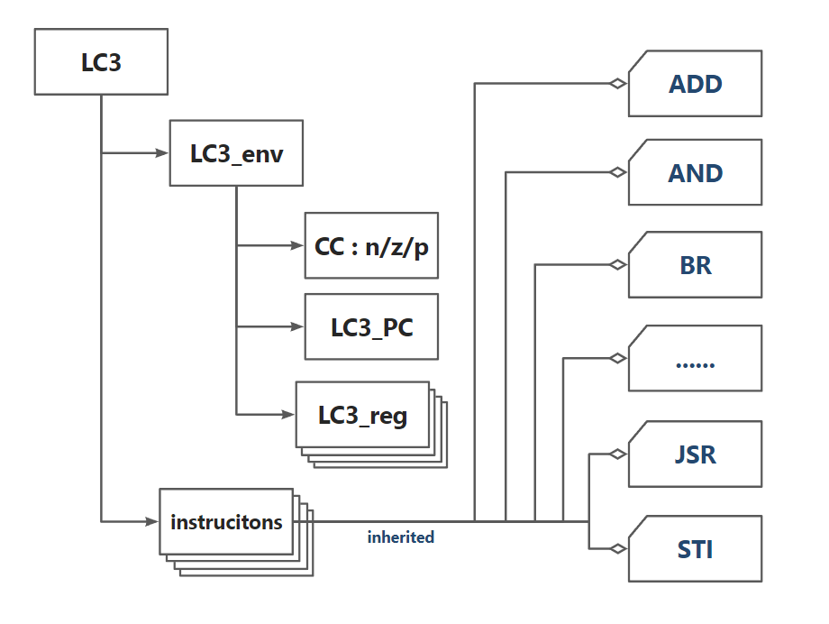

## Algorithm explanation

- Just big simulation.
- I programmed this with C++ as OOP exercises.
- The classes are organized like the picture below. (arrow means contain and square means inherit)



- So after reading all the instructions in, I will first initialize a LC3 instance which has all the instructions stored as instruction class which will be routed before being executed and environment information such as registers, PC and CC.
- Then, we just need to run the LC3 instance and instructions will be executed on its own accomplish, which is just like the finite state machine figure described.

## Essential parts of your code with sufficient comments

```cpp
int main(){
    vector< string > instructionsStrings(0);
    string str;
    // Read in the input instructions.
    while(cin >> str){
        instructionsStrings.push_back(str);
    }
    // Create a little computer class here and load all the instructions and data.
    LC3 lc(instructionsStrings);
    // Run the instructions.
    lc.run();
    // Show all the regsiters.
    lc.regMonitor();
    return 0;
}
```

```cpp
// Defination of LC3 class.
class LC3{
private:
    LC3_env env;							// Store the env informations.
    vector< LC3_instructions * > ins;		  // Store all the instrucitons and data.
public:
    LC3(){}
    // C'tor, init env and ins here.
    LC3(vector< string > vs): env( bstoi(vs[0].substr(0,16)) ){
        int locPtr = env.pc.getMPC();
        for(auto it = vs.begin()+1; it != vs.end();++it){
            auto insTmp = new LC3_instructions(*it, locPtr++);
            this->ins.push_back(insTmp);
        }
        // It can be optimized.
        ins.resize(1000000);
        envTmp = env;
    }
    ~LC3(){}
    void run(){
        env = envTmp;
        env.alive = true;
        while(env.alive){ // Keep running before halt.
            auto ins_to_load = ins[ env.pc.getVPC() ];
            // Deal instruction in dynamic ways.
            // I try to use polymorphism here but things will be complex and unsafe in that case.
            auto ins_to_exec = routing(ins_to_load->getContent(), ins_to_load->getLoc());
            // Increase pc.
            env.pc.inc();
            // Execute the instruction.
            ins_to_exec->exec(env, ins);
            delete ins_to_exec;
        }
    }
    void regMonitor(){
        for(int i = 0;i < 8;++i){
            cout << "R" << i << " = x" << setiosflags(ios::uppercase) << setw(4) << setfill('0') << hex << env.reg[i].getVal() << dec << "\n";
        }
    }
};
```

```cpp
// Choose the correct instrucion to execute.
LC3_instructions * routing(string ins, int loc){
    LC3_instructions * ret;
    string opcode = ins.substr(0,4);
    if(opcode == "0001"){
        ret = new LC3_ins_ADD(ins, loc);
    } else if(opcode == "0101"){
        ret = new LC3_ins_AND(ins, loc);
	} else {
        // ......
    } else {
        ret = new LC3_instructions(ins, loc);
    }
    return ret;
}
```

```cpp
// The base class of all other classes.
class LC3_instructions{
protected:
    string content;
    int location;
    int val;
public:
    LC3_instructions(){}
    LC3_instructions(string, int){}
    ~LC3_instructions(){}
    int getVal(){}
    string getContent(){}
    int getLoc(){}
    virtual void exec(LC3_env &env, vector< LC3_instructions * > &insList){}
};
```

```cpp
// e.g. JSR
class LC3_ins_JSR : public LC3_instructions{
protected:
    int offset, base;
    bool useOffset;
public:
    LC3_ins_JSR(){}
    LC3_ins_JSR(string & ins, int loc = 0): LC3_instructions(ins, loc){
        // Parse the oprands.
        useOffset = ins[4] - '0';
        if(useOffset) offset = exbstoi( ins.substr(5,11) );
        else base = bstoi( ins.substr(7,3) );
    }
    ~LC3_ins_JSR(){}
    virtual void exec(LC3_env &env, vector< LC3_instructions * > &insList){
        // Save pc to R7.
        env.reg[7].setVal( env.pc.getMPC() );
        int newPC;
        if(useOffset) newPC = (env.pc.getMPC() + offset) % overflow;
        else newPC = env.reg[base].getVal();
        // Set new pc.
        env.pc.setMPC( newPC );
    }
};
```

